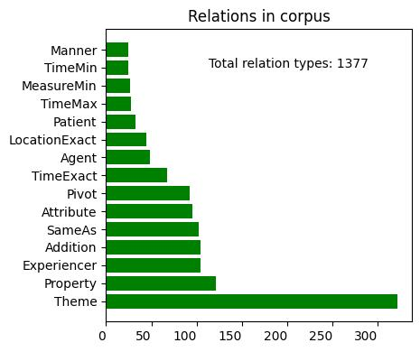

# MR4AP-wikipedia corpus (v0.1)

## Disclaimer

This corpus is supposed to grow in size.

## Repository contents

This repository hosts the **MR4AP-wikipedia** corpus v0.1. The `files` folder contains a subfolder per language. Each
subfolder contains the available JSON files. Those files present three main fields:
* `id`: the text id,
* `text`: the plain text,
* `rdf`: the corresponding RDF representation containing the annotations.

Each filename follows the following syntax `Wikipedia_article_name_in_French_language.json`. The `_language` part is
not used for French texts.

## How was this dataset created?

This dataset is the result of a manual annotation effort. What the annotators did was:
* Select 5 random Wikipedia articles in French,
* Manually annotate the first 3 sentences of each document using the INCEpTION tool,
* Automatically translate them into English, Spanish, Italian, and Modern Standard Arabic (MSA),
* Manually annotate them.

Not all the texts were annotated in each language. However, more texts in French were annotated. 
Here is an overview of the dataset's contents:

| Language  | Documents | Sentences |
|-----------|-----------|-----------|
| French    | 20        | 60        |
| English   | 4         | 12        |
| Italian   | 4         | 12        |
| MSA       | 4         | 12        |
| Spanish   | 1         | 3         |
| **Total** | **33**    | **99**    |

The annotation effort must continue! If you want to try MR4AP out, you can find:
* Extensive annotation guidelines [here](../../guidelines/guidelines.md).
* An INCEpTION practical guide [here](../../guidelines/guidelines.md#how-to-inception-a-practical-guide),
* The INCEpTION layers and tagsets [here](),

Feel free to reach out if you need any more information.
* bastien.giordano [at] emvista.com
* cedric.lopez [at] emvista.com

## Corpus statistics

These statistics take into account every annotated text in every languages. For language-specific statistics, please
see the corresponding folders.

| Item                            | Number |
|---------------------------------|--------|
| Tokens                          | 2,299  |
| Avg tokens per sentence         | 23.22  |
| Nodes                           | 1,432  |
| Avg entities per document       | 23.12  |
| Avg dynamic events per document | 5.33   |
| Avg stative events per document | 9.76   |
| Relations                       | 1,377  |
| Cross-sentence relations        | 76     |
| Avg relations per document      | 41.73  |

Below are some additional insights.

