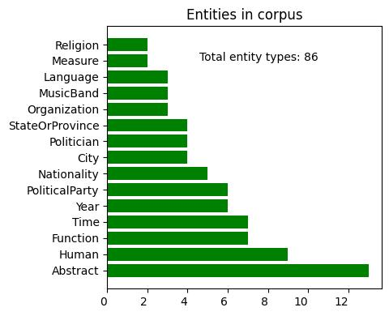
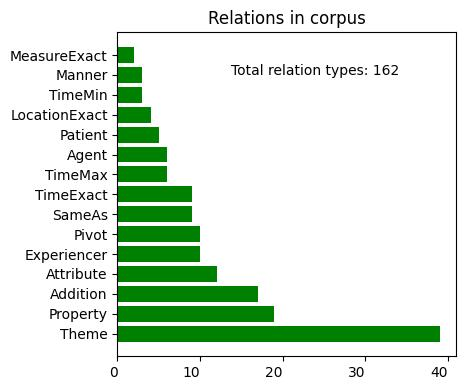
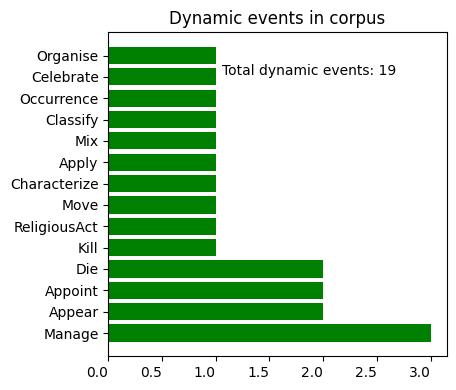
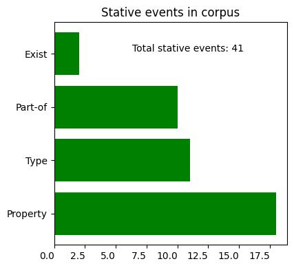

# MR4AP-wikipedia-es

## Disclaimer

See the [MR4AP-wikipedia page](../../README.md) for information about the whole corpus.

## Language-specific corpus statistics

| Item                            | Number |
|---------------------------------|--------|
| Documents                       | 1      |
| Sentences                       | 3      |
| Tokens                          | 72     |
| Avg tokens per sentence         | 24.0   |
| Nodes                           | 47     |
| Avg entities per document       | 25.0   |
| Avg dynamic events per document | 4.0    |
| Avg stative events per document | 14.0   |
| Relations                       | 52     |
| Avg relations per document      | 40.5   |

Below are some additional insights.

  
Fig.: Most frequent semantic types (k=15)

  
Fig.: Most frequent relation types (k=15)

  
Fig.: Most frequent dynamic event classes (k=15)

  
Fig.: Frequency for stative event classes