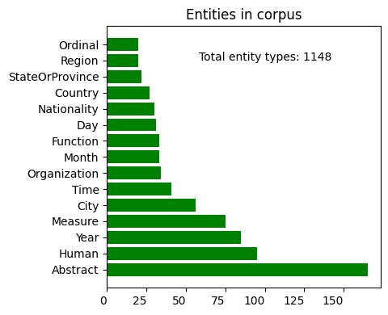
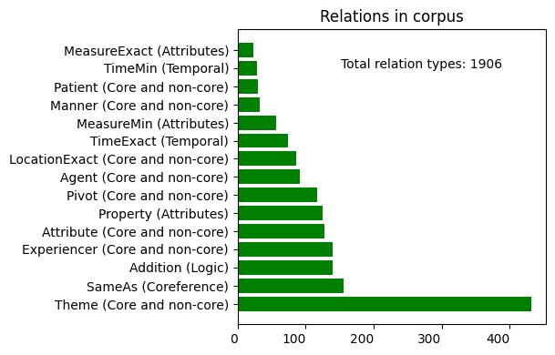
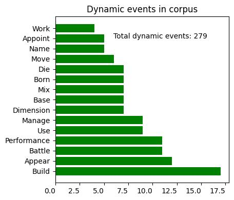
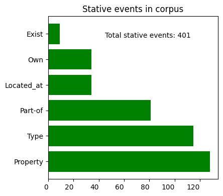

# MR4AP-wikipedia-fr

## Disclaimer

See the [MR4AP-wikipedia page](../../README.md) for information about the whole corpus.

## Language-specific corpus statistics

| Item                            | Number |
|---------------------------------|--------|
| Documents                       | 20     |
| Sentences                       | 60     |
| Tokens                          | 1,418  |
| Avg tokens per sentence         | 23.63  |
| Nodes                           | 859    |
| Avg entities per document       | 23.7   |
| Avg dynamic events per document | 5.9    |
| Avg stative events per document | 9.25   |
| Relations                       | 845    |
| Cross-sentence relations        | 50     |
| Avg relations per document      | 42.25  |

Below are some additional insights.

  
Fig.: Most frequent semantic types (k=15)

  
Fig.: Most frequent relation types (k=15)

  
Fig.: Most frequent dynamic event classes (k=15)

  
Fig.: Frequency for stative event classes