Meaning Representation for Application Purposes - Annotation Guidelines
=======================================================================

**October 02, 2023**

Authors: *Bastien Giordano, Cédric Lopez*

## Table of contents
1. [Introduction to MR4AP](#introduction-to-mr4ap)
2. [Predicate-argument structure](#predicate-argument-structure)
   1. [Events and entities](#events-and-entities)
      1. [Dynamic events](#dynamic-events)
      2. [Stative events](#stative-events)
      3. [Factual annotation](#factual-annotation)
      4. [Reified predicates](#reified-predicates)
      5. [Implicit predicates and arguments](#implicit-predicates-and-arguments)
      6. [Anchorage and redundancy](#anchorage-and-redundancy)
   2. [Relation types](#relation-types)
      1. [Core and non-core relations](#core-and-non-core-relations)
      2. [Temporal relations](#temporal-relations)
         1. [`TimeFrequency`: a special case](#timefrequency-a-special-case)
      3. [Discourse relations](#discourse-relations)
         1. [`Comparison`: a special case](#comparison-a-special-case)
            1. [Comparatives](#Comparatives)
            2. [Superlatives](#Superlatives)
            3. [Other constructions](#other-constructions)
      4. [Coreference relations](#coreference-relations)
      5. [Other relations](#other-relations)
         1. [`Relative`: when one is not enough](#relative-when-one-is-not-enough)
3. [Multiword expressions (MWEs)](#multiword-expressions-mwes)
   1. [Entities](#entities)
   2. [Light-verb constructions (LVCs)](#light-verb-constructions-lvcs)
   3. [Verb-particle constructions (VPCs)](#verb-particle-constructions-vpcs)
   4. [Idioms](#idioms)
4. [Questions](#questions)
   1. [Polar questions](#polar-questions)
   2. [Alternative questions](#alternative-questions)
   3. [Variable questions](#variable-questions)
5. [MR4AP attributes](#mr4ap-attributes)
   1. [Attribute nodes and `Argument{In,Out}` relations](#attribute-nodes-and-argumentinout-relations)
   2. [Semantic typing](#semantic-typing)
      1. [Named Entities and Word Senses](#named-entities-and-word-senses)
      2. [Gender](#gender)
      3. [Question types](#questions)
   3. [Aspect](#aspect)
      1. [Event nominals](#event-nominals)
      2. [Habitual](#habitual)
      3. [State](#state)
      4. [Activity](#activity)
      5. [Endeavor](#endeavor)
      6. [Performance](#performance)
   4. [Quantification](#quantification)
      1. [Usual cases](#usual-cases)
      2. [Quantification in comparisons](#quantification-in-comparisons)
      3. [Quantification and superlatives](#quantification-and-superlatives)
      4. [Other uses of quantification](#other-uses-of-quantification)
   5. [Polarity (and scope)](#polarity-and-scope)
   6. [Modality (and scope)](#modality-and-scope)
      1. [Obligation](#obligation)
      2. [Capacity](#capacity)
      3. [Wish](#wish)
      4. [Suggestion](#suggestion)
      5. [Uncertainty](#uncertainty)
      6. [Temporality](#temporality)
   7. [Degree](#degree)
      1. [Intensifiers and downtoners](#intensifiers-and-downtoners)
      2. [Degree-consequence constructions](#degree-consequence-constructions)
6. [Coreference and anaphora](#coreference-and-anaphora)
   1. [Event coreference](#event-coreference)
   2. [Entity coreference](#entity-coreference)
   3. [Possessive anaphora](#possessive-anaphora)
7. [Annotation cheatsheet](#annotation-cheatsheet)
   1. [How to INCEpTION: a practical guide](#how-to-inception-a-practical-guide) 
      1. [Getting started](#getting-started)
      2. [Make use of the asterisks](#make-use-of-the-asterisks)
      3. [Annotating entities](#annotating-entities)
      4. [Annotating predicates](#annotating-predicates)
      5. [Annotating implicit elements](#annotating-implicit-elements)
      6. [Annotating stative events](#annotating-stative-events)
      7. [Annotating relations](#annotating-relations)
      8. [Annotating attributes](#annotating-attributes)
      9. [Annotating values](#annotating-values)
      10. [Reifiying attribute nodes](#reifying-attribute-nodes)
   2. [Relations and values](#relations-and-values)
   3. [Complete example](#complete-example)

--- 

## Introduction to MR4AP

MR4AP is a meaning representation formalism designed by Emvista. Being used in an industrial context, it was thought 
with a definitive applicative aim. As such, two watchwords guided its design:
* **Genericity**: The formalism must be able to detach itself from the surface form in order to transcribe the meaning 
despite syntactic idiosyncrasies. It also must be applied regardless of the language one wishes to work with.
* **Explicitness**: The formalism uses directed graphs and as such, its explicitness is partly based upon the naming of the
relations used: having relations too coarse-grained, too fine-grained, or opaque is detrimental to its efficient 
understanding. Moreover, all entities must be semantically typed to avoid having to gloss their meanings.

MR4AP has been designed with the firm belief that a meaning representation formalism, to be complete, 
cannot stop with representing content at the sentence level, but must be extended to take into account 
the entirety of documents. Moreover, still in this search for completeness, all levels of relations must be 
represented: temporality, discourse, and coreference.

<[back to the table of contents](#table-of-contents)>
## Predicate-argument structure

MR4AP follows a predicate-argument structure. As such, the core of its design revolves around the identification 
of predicates and their arguments.

Note: MR4AP does not cling to any resource in particular. The vocabulary used to denote predicate classes may come from 
diverse resources, such 
as VerbNet ([Schuler, 2005](https://www.proquest.com/openview/7ca4b1b9093522a7d8089ff2e987e74e/1?pq-origsite=gscholar&cbl=18750&diss=y)), 
FrameNet ([Baker et al., 1998](https://aclanthology.org/P98-1013.pdf)), 
or PropBank ([Palmer et al., 2005](https://aclanthology.org/J05-1004.pdf)).
In the examples provided throughout these guidelines, every frame goes with a prefix to indicate its source 
(`vn:`, `fn:`, `pb:` for the aforementioned resources, `em:` for Emvista's). Every example represents meaning using RDF
triples following the [Turtle](https://www.w3.org/TR/turtle/) syntax. In fact, whenever we refer to a relation, its 
equivalent within the examples will be noted like this: `:has_[relation]`. What's more, the annotations provided 
always target a specific element and are never exhaustive unless specified.

<[back to the table of contents](#table-of-contents)>
### Events and entities

MR4AP treats the predicate-argument structure as an event-entity structure.
Events are split into two categories:
* **Dynamic events**: "actions" in the neo-Davidsonian sense, or "processes".
* **Stative events**: states and changes of state, possession, location, existential predication.

<[back to the table of contents](#table-of-contents)>
#### Dynamic events

Dynamic events denote processes or actions. Such events are typically denoted by verbs and nouns.
The following sentences all express the logical expression `arrest(police,John)`:

```console
The police arrested John.
The police, who arrested John, (...).
The police arresting John (...).
The police wanted to arrest John.
John's arrestation by the police (...).
```

MR4AP transposes these logical representations into graph representations using named relations to link events and their
relative entities (see the [Relation types](#relation-types) section).

Note: For practical guidelines regarding the annotation of dynamic events with the INCEpTION platform, refer to the 
[Annotating predicates](#annotating-predicates) section.

<[back to the table of contents](#table-of-contents)>
#### Stative events

Even though stative events are considered as events as well, they do not denote actions. 
Stative events include the following:

| Stative event type        | Example                       | Predicate/Relations                                                                                  |
|---------------------------|-------------------------------|------------------------------------------------------------------------------------------------------|
| Thetic possession         | John has two cats.            | `:own :has_pivot "possessor"`<br/>`:own :has_theme "possessum"`                                      |
| Predicational possession  | The two cats are John's.      | `:own :has_pivot "possessor"`<br/>`:own :has_theme "possessum"`                                      |
| Predicational location    | John's cats are on the table. | `:is_located_at :has_theme em:entity`<br/>`:is_located_at :has_location{exact,fuzzy,span} :location` |
| State and change of state | John is a doctor.             | `:type :has_experiencer em:entity`<br/>`:type :has_attribute prefix:category`                        |
| Predicational property    | John's cats are black.        | `:property :has_theme em:entity` <br/> `:property :has_property prefix:property`                     |
| Existential predication   | There was a cat.              | `:exist :has_experiencer em:entity`                                                                  |

Creating such nodes is mandatory in order to specify potential attributes regarding temporality, modality, polarity, etc.  
This also holds true when these nodes are linked to others (*e.g.*, by discourse or temporal relations).

```console
Had he worked smarter, John could have become a doctor.

:type :has_experiencer "John"
:type :has_attribute "doctor"
:type :has_timemin "DCT"
:type :has_modality "capacity"
:type :has_condition vn:work-73.2
```

Note: For practical guidelines regarding the annotation of stative events with the INCEpTION platform, refer to the 
[Annotating stative events](#annotating-stative-events) section.

<[back to the table of contents](#table-of-contents)>
#### Factual annotation

The factual character of MR4AP mainly lies within the fact that it exploits multi-rooted graphs. Contrary to most
formalisms, there is no need to choose a root node for the graph. This leaves no place to the annotator's subjectivity,
hence the "factuality" of the annotation process.

The most recent formalisms argue that the more the representation abstracts away from the syntactic surface form, the 
better the representation. This holds true for typical examples with the passive or active voices. In the
following (complete) example, even though the syntactic realization is different, the meaning is strictly equivalent. 
Therefore, the resulting annotations can't be different from one another.

```console
John broke the vase.
The vase was broken by John.

vn:break-45.1 :has_agent "John"
vn:break-45.1 :has_patient "vase"
vn:break-45.1 :has_timemax "DCT"
vn:break-45.1 :has_aspect "performance"
"vase" :has_measureexact "1"
"John" :has_type em:Thing/Concrete/Animate/Livingbeing/Human
"vase" :has_type em:Thing/Concrete/Inanimate/Product
```

However, the same mindset should be extended to other phenomena as well, leaving no choice or doubt to the annotator.
For instance, we consider that the representations of adjectives should remain the same whatever the function. Instead 
of having a specific representation for attributive adjectives (*i.e.*, in modification function) and another for 
predicative adjectives (*i.e.*, in predication function), we annotate both of these using the same formalization.

```console
[Predicative]
القط هادئ
(al-qiṭṭu hādiʾ, lit. "the-cat quiet", transl. "the cat is quiet")

:property :has_theme "قط"
:property :has_property pb:quiet.04

---

[Attributive]
ينام القط الهادئ
(yanāmu al-qiṭṭu al-hādiʾ, lit. "sleeps the-cat the-quiet", transl. "the quiet cat is sleeping")

:property :has_theme "قط"
:property :has_property pb:quiet.04
```

That being said, some predicative adjectives might evoke dynamic events predicates instead.

```console
John has been dead since 2010.
John died in 2010.

vn:die-42.4-1 :has_patient "John"
vn:die-42.4-1 :has_timemin "2010-01-01T00:00"
vn:die-42.4-1 :has_timemax "2010-31-12T23:59"
```

<!-- TODO: parler des réentrances quelque part (retrouver le papier qui parlait des réentrances avec les différentes configurations syntaxiques prototypiques des réentrances -->

<[back to the table of contents](#table-of-contents)>
#### Reified predicates

Reified predicates are used for coordination:
* `:addition` for conjunctions,
* `:alternative` for disjunctions.

```console
John loves swimming and running.

:addition :has_addition vn:run-51.3.2-1 .
:addition :has_addition vn:run-51.3.2-2-1 .

---
 
On Monday, John either swims or runs.

:alternative :has_alternative vn:run-51.3.2-1 .
:alternative :has_alternative vn:run-51.3.2-2-1 .
```

More than two elements can be coordinated. Coordinated elements can be anything.

```console
John loves swimming, cycling and running.

:addition :has_addition vn:run-51.3.2-1 .
:addition :has_addition vn:drive-11.5 .
:addition :has_addition vn:run-51.3.2-2-1 .

---
 
John loves the lake, his bike and his running shoes.

:addition :has_addition "lake" .
:addition :has_addition "bike" .
:addition :has_addition "running shoes" .
```

Other cases of reification can occur. For instance, the `Modality` attribute might need to be reified to have additional
information linked to it, such as a negative polar value. See the [Attribute nodes and `Argument{In,Out}` relations](#attribute-nodes-and-argumentinout-relations) section
for more details about it.

<[back to the table of contents](#table-of-contents)>
#### Implicit predicates and arguments

In a number of cases, predicates and arguments can be implicit, *i.e.*, the linguistic form does not convey what an 
utterance's meaning does. Implicit elements must be rendered explicit while annotating.

```console
John arrived before Mary.
(=John arrived before Mary arrived/did.)

vn:escape-51.1-1$1 :has_agent "John" .
vn:escape-51.1-1$2 :has_agent "Mary" .
vn:escape-51.1-1$1 :has_timemax vn:escape-51.1-1$2 .
```

```console
John bought three green apples whereas Mary two red.
(=John bought three green apples whereas Mary bought two red apples.)

vn:get-13.5.1$1 :has_agent "John" .
vn:get-13.5.1$1 :has_theme "apples"$1 .
"apples"$1 :has_measureexact "3" .
:property$1 :has_theme "apples"$1 .
:property$1 :has_property pb:green.02 .
vn:get-13.5.1$1 :has_opposition vn:get-13.5.1$2 .
vn:get-13.5.1$2 :has_opposition vn:get-13.5.1$1 .
vn:get-13.5.1$2 :has_agent "Mary" .
vn:get-13.5.1$2 :has_theme "apples"$2 .
"apples"$2 :has_measureexact "2" .
:property$2 :has_theme "apples"$2 .
:property$2 :has_property pb:red.02 .
```

```console
John is sick and Mary is too.
(=John is sick. Mary is sick.)

:property$1 :has_theme "John" .
:property$1 :has_property pb:sick.04$1
:property$2 :has_theme "John" .
:property$2 :has_property pb:sick.04$2
:addition :has_addition :property$1 .
:addition :has_addition :property$2 .
```

Note: For practical guidelines regarding the annotation of implicit elements with the INCEpTION platform, refer to the 
[Annotating implicit elements](#annotating-implicit-elements) section.

<[back to the table of contents](#table-of-contents)>
#### Anchorage and redundancy

MR4AP is an anchored meaning representation of Flavor 1 according to the typology of 
[Oepen et al. (2019)](https://aclanthology.org/K19-2001.pdf). 
This means that direct correlations exist between the nodes produced in the graphs and the surface tokens. 
However, not every token produces a node: some trigger relations (*e.g.*, discourse connectors) while others are simply
dismissed.

MR4AP aims at representing meaning, not surface form. As such, some tokens can easily be dropped from the 
representation. This the case of light verbs in light-verb constructions (see the 
[Light-verb constructions](#light-verb-constructions-lvcs) section).  
Dropping tokens should also be done when redundant elements need not be annotated.

```console
The Sherani district is located in the Balochistan province.

"Sherani" :has_type em:Thing/Abstract/Location/District . 
"Balochistan" :has_type em:Thing/Abstract/Location/StateOrProvince .
em:Thing/Abstract/Location/District :is_located_at em:Thing/Abstract/Location/StateOrProvince .
```

In this particular example, there is no use in typing "district" as an `em:Thing/Abstract/Location/District` as 
"Sherani" already is. The same goes for "province", which does not need to be typed as 
`em:Thing/Abstract/Location/StateOrProvince` since "Balochistan" already is.

<[back to the table of contents](#table-of-contents)>
### Relation types

In its search for explicitness, MR4AP requires every relation to be named.  
The different types of relations are described in the following sections.

Note: For practical guidelines regarding the annotation of relations with the INCEpTION platform, refer to the 
[Annotating relations](#annotating-relations) section.

<[back to the table of contents](#table-of-contents)>
#### Core and non-core relations

Core relations symbolize prototypical predicate-argument relations, as can be detailed in some resources like VerbNet.  
For instance, the `vn:eat-39.1` frame is described as follows: `Agent [+animate] V Patient [+comestible]`

```console
John ate the apple.

vn:eat-39.1 :has_agent "John" .
vn:eat-39.1 :has_patient "apple" .
```

Non-core relations symbolize optional predicate-argument relations.

```console
John ate the apple with a fork.

vn:eat-39.1 :has_instrument "fork" .
```

Here is an exhaustive list of the core and non-core relations along with examples.  
Those must be read from the underlined token to the bold one with the corresponding relation 
(*e.g.*, **John** <ins>ate</ins> an apple -> `vn:eat-39.1 :has_agent "John"`).

| Relation        | Example                                                                     |
|-----------------|-----------------------------------------------------------------------------|
| `Agent`         | **John** <ins>ate</ins> an apple.                                           |
| `Pivot`         | **John** <ins>craves</ins> new shoes.                                       |
| `Cause`         | **John** made Mary <ins>eat</ins> an apple.                                 |
| `Theme`         | John <ins>ordered</ins> **sushi**.                                          |
| `Patient`       | John <ins>ate</ins> an **apple**.                                           |
| `Topic`         | John <ins>read</ins> a **book**.                                            |
| `Recipient`     | John <ins>sent</ins> a letter to **Mary**.                                  |
| `Beneficiary`   | John <ins>helped</ins> **Mary**.                                            |
| `Experiencer`   | **John** <ins>saw</ins> Mary.                                               |
| `Stimulus`      | John <ins>saw</ins> **Mary**.                                               |
| `Result`        | John <ins>broke</ins> the vase into **pieces**.                             |
| `Attribute`     | John <ins>praised</ins> the **courage** of the volunteers.                  |
| `Product`       | John <ins>built</ins> a **house**.                                          |
| `Location`      | John <ins>built</ins> a house in **France**.                                |
| `LocationExact` | John <ins>built</ins> a house...                                            |
| `LocationSpan`  | John <ins>found</ins> a treasure between Marseille **and** Montpellier.\*   |
| `LocationFuzzy` | John <ins>built</ins> a house somewhere in **France**.                      |
| `Source`        | John <ins>emptied</ins> the trash from the **trash can** into the dumpster. |
| `Destination`   | John <ins>emptied</ins> the trash from the trash can into the **dumpster**. |
| `Manner`        | John **quickly** <ins>built</ins> a house.                                  |
| `Instrument`    | John <ins>traveled</ins> on his **bike**.                                   |
| `Material`      | John <ins>built</ins> a **brick** house.                                    |
| `Value`         | John <ins>estimated</ins> the probability at **20%**.                       |
| `Asset`         | John <ins>billed</ins> Mary for 100 **euros**.                              |
| `Event`         | John <ins>attended</ins> the **meeting**.                                   |
| `Unknown`       | \**                                                                         |
| `Relative` \*** | John dances five <ins>meters</ins> from the **table**.                      |

\* `LocationSpan` includes at least two elements. As specified earlier, conjunctions are modelized using `addition` nodes 
(see the [Reified predicates](#reified-predicates) section), hence the bold "and".  
\** `Unknown` is only used to mark polar and alternative questions (see the [Questions](#questions) section).  
\*** `Relative` is used when a predicate is expressed in relation with another one through a pivot 
(see the [`Relative`: when one is not enough](#relative-when-one-is-not-enough) section).

<[back to the table of contents](#table-of-contents)>
#### Temporal relations

Temporal relations are relations symbolizing temporality between two predicates.
They occur both at the sentence and the document level.

```console
John left before Mary entered the room.

vn:leave-51.2-1 :has_timemax vn:escape-51.1-1-2 .
```

Temporality can also be an attribute when it does not connect two predicates.

```console
John worked yesterday.

vn:work-73.2 :has_timemin "2023-05-04@00:00" .
vn:work-73.2 :has_timemax "2023-05-04@23:59" .
```

Temporality can also be linked to the document creation time (DCT). 
This link should be instantiated when no explicit temporal mentions is present:

```console
John agreed with Mary.

vn:correspond-36.1-1 :has_timemax "DCT" .

---

Before leaving, John waved to Mary.

vn:wink-40.3.1 :has_timemax vn:leave-51.2-1 .
vn:leave-51.2-1 :has_timemax "DCT" .
```

In the latter example, the annotator can certify that the waving event happened before the leaving event. However,
if the leaving event isn't relatively linked to any other, temporal information is lost. Anchoring the leaving event
before the DCT allows to deduce a chronology:
* `vn:wink-40.3.1` happened before `vn:leave-51.2-1`,
* `vn:leave-51.2-1` happened before the DCT,
* Therefore the chronology is: `vn:wink-40.3.1`> `vn:leave-51.2-1`> DCT.

Here is an exhaustive list of temporal relations with examples.  
Those must be read from the underlined token to the bold one with the corresponding relation 
(*e.g.*, Before Mary **entered** the room, John <ins>left</ins> -> `vn:leave-51.2-1 :has_timemax vn:vn:escape-51.1-1-2`).

| Proto-relation | Relation             | Example                                                          |
|----------------|----------------------|------------------------------------------------------------------|
| `Time`\*       | `TimeExact`          | As soon as Mary **entered** the room, John <ins>left</ins>.      |
|                | `TimeMin`            | After Mary **entered** the room, John <ins>left</ins>.           |
|                | `TimeMax`            | Before Mary **entered** the room, John <ins>left</ins>.          |
|                | `TimeFuzzy`          | Around the time Mary **entered** the room, John <ins>left</ins>. |
|                | `TimeDuration`       | As Mary **entered** the room, John <ins>left</ins>.              |
|                | `TimeFrequency`\**   | John **trains** five <ins>times</ins> a week.                    |

\* `Time` is the most coarse-grained temporal relation. This relation must be avoided as much as possible as the
finer-grained relations are preferred. However, whenever the annotator is in doubt, they should fall back to this label.
\** `TimeFrequency` is somewhat of a special case as it often works in conjunction with a `Measure` and with
a `Relative` (see the [`TimeFrequency`: a special case](#timefrequency-a-special-case) section).

<[back to the table of contents](#table-of-contents)>
##### `TimeFrequency`: a special case

The expression of frequency implies measuring the number of times something occurs. This measure can also be specified
against a time period. Therefore, the `TimeFrequency` relation can only work in conjunction with other elements. Here
are two examples and their respective representation.

```console
John trains five times a week.

pb:train.01 :has_agent "John" .
pb:train.01 :has_timefrequency em:Occurrence .
em:Occurrence :has_measureexact "5" .
em:Occurrence :has_relative em:Thing/Abstract/Unit/TimeUnit/Week . 
em:Thing/Abstract/Unit/TimeUnit/Week :has_measureexact "1" .

```

<[back to the table of contents](#table-of-contents)>
#### Discourse relations

Discourse relations are relations symbolizing discourse connections between predicates. 
They occur both at the sentence and the document level.

```console
If John was working, he would have helped Mary.

vn:help-72.1-1 :has_condition vn:work-73.2 .

---

John was not working yesterday. As a consequence, he could not help Mary.

vn:work-73.2 :has_cause vn:help-72.1-1 .
vn:help-72.1-1 :has_consequence vn:work-73.2 .
```

Here is an exhaustive list of discourse relations with examples.  
Those must be read from the underlined token to the bold one with the corresponding relation 
(*e.g.*, If John wants to **leave**, he has to <ins>ask</ins> first 
-> `vn:inquire-37.1.2 :has_condition vn:leave-51.2-1`). 

| Relation         | Example                                                                                           |
|------------------|---------------------------------------------------------------------------------------------------|
| `Cause`\*        | John **asked** first, so he <ins>left</ins>.                                                      |
| `Consequence`    | John <ins>asked</ins> first, so he **left**.                                                      |
| `Opposition`\**  | John <ins>**asked**</ins> first, but he didn't <ins>**leave**</ins>.                              |
| `Conclusion`     | John has been <ins>working</ins> with precision for years. In short, he **deserves** a promotion. |
| `Comparison`\*** | John always <ins>works</ins> with precision. Conversely, Mary doesn't **do** much.                |
| `Condition`      | If John wants to **leave**, he has to <ins>ask</ins> first.                                       |
| `Explanation`    | Writing this report will <ins>take</ins> time, especially since John is not **working**.          |
| `Illustration`   | John <ins>works</ins> with precision. For example, he **wrote** this excellent report.            |
| `Purpose`        | John wants to <ins>leave</ins> to **attend** his medical appointment.                             |
| `Restriction`    | John <ins>left</ins> even though he didn't **ask** first.                                         |
| `Whatever`       | No matter that John **asked**, he can't <ins>leave</ins>.                                         |

\* `Cause` and `Consequence` go hand in hand when related to discourse (see the aforementioned example). 
When `Cause` is a thematic role (see the [Core and non-core relations](#core-and-non-core-relations) section) however, 
the `Consequence` relation must not be annotated.  
\** `Opposition` can be seen as a bi-directional relation. Whenever two elements are opposed in discourse, the relation
must go from and to each element.  
\*** `Comparison` comes with sub-relations (see the [Comparison: a special case](#comparison-a-special-case) section).

<[back to the table of contents](#table-of-contents)>
##### `Comparison`: a special case

The `Comparison` relation has several derivative labels.
Those derivative labels are introduced in order to represent comparatives and superlatives.

<[back to the table of contents](#table-of-contents)>
###### Comparatives

MR4AP remains consistent in the vocabulary used for derivative labels: `Comparison{Exact,Min,Max,Fuzzy}`. These 
relations are two-way: one or both can be annotated.  
Note that implicit predicates must be used in order to represent the comparison taking place (see the 
[Implicit predicates and arguments](#implicit-predicates-and-arguments) section). These implicit predicates
are duly mentioned (using the `$implicit` annotation) along with the following examples.

```console
John is as kind as Mary [ø = is kind].

:property :has_theme "John" . 
:property :has_property pb:wealthy.01 .
:property$implicit :has_theme "John" .
:property$implicit :has_property pb:wealthy.01 . 
:property :has_comparisonexact :property$implicit . 
:property$implicit :has_comparisonexact :property . 

---

John is wealthier than Mary [ø = is wealthy].

:property :has_theme "John" .
:property :has_property pb:wealthy.01 . 
:property$implicit :has_theme "John" . 
:property$implicit :has_property pb:wealthy.01 . 
:property :has_comparisonmin :property$implicit .
:property$implicit :has_comparisonmax :property .

---

John is less smart than Mary [ø = is smart].

:property :has_theme "John" .
:property :has_property pb:smart.06 . 
:property$implicit :has_theme "John" . 
:property$implicit :has_property pb:smart.06 . 
:property :has_comparisonmax :property$implicit .
:property$implicit :has_comparisonmin :property .

---

John is about as reckless as Mary [ø = is reckless].

:property :has_theme "John" .
:property :has_property pb:reckless.01 . 
:property$implicit :has_theme "John" . 
:property$implicit :has_property pb:reckless.01 . 
:property :has_comparisonfuzzy :property$implicit .
:property$implicit :has_comparisonfuzzy :property .
```

The same goes for verbal predicates. If the predicates in comparison are not all explicit, instantiating the implicit
ones is mandatory. Consider the following example.

```console
John works more than Mary [ø = does / works].

vn:work-73.2 :has_agent "John" .
vn:work-73.2$implicit :has_agent "Mary" .
vn:work-73.2 :has_comparisonmin vn:work-73.2$implicit .
vn:work-73.2$implicit :has_comparisonmax vn:work-73.2 .
```

<[back to the table of contents](#table-of-contents)>
###### Superlatives

As for superlatives, there are two relevant relations: `Comparison{Min,Max}`.  
Superlatives remain an expression of comparison, whether the compared element be explicit or implicit.

```console
(1) John is the smartest of his siblings. (= John is smarter than his siblings)

:property :has_theme "John" .
:property :has_property pb:smart.06 . 
:property$implicit :has_theme "siblings" .
:property$implicit :has_property pb:smart.06$implicit . 
:property :has_comparisonmax :property$implicit .

---

(2) John is the smartest ø. (= John is smarter than {everyone else, his siblings, his football team members, ...})

:property :has_theme "John" .
:property :has_property pb:smart.06 . 
:property$implicit :has_theme "implicit_argument" .
:property$implicit :has_property pb:smart.06$implicit . 
:property :has_comparisonmax :property$implicit.
```

<[back to the table of contents](#table-of-contents)>
###### Other constructions

As shown by Bonial et al. (2018), other constructions such as _The X-er, 
the Y-er_ or degree-consequence constructions need to be addressed and be incorporated in meaning representations 
(see the [Degree](#degree) section). The former construction _(The X-er, the Y-er)_ is annotated like the following 
example:

```console
The more we include, the better the representation.
(=The more {things,elements,items} we include, the better the representation is.)

<!-- TODO --> 

---

The faster, the better.
(=The faster something is, the better this something is.)

<!-- TODO --> 
```

<[back to the table of contents](#table-of-contents)>
#### Coreference relations

Coreference relations are relations symbolizing coreference between entities or events.  
MR4AP uses only one label for those: `SameAs`. See the [Coreference section](#coreference-and-anaphora).

<[back to the table of contents](#table-of-contents)>
#### Other relations

Some relations which MR4AP makes use of do not fit into any aforementioned categories.

<[back to the table of contents](#table-of-contents)>
##### `Relative`: when one is not enough

In some utterances, an entity has to be positioned relatively to another. MR4AP makes use of the `Relative` relation
to be able to do so.

```console
John is five meters from the table.

em:is_located_at :has_theme "John" .
em:is_located_at :has_location "meters" .
"meters" :has_measureexact "five" .
"five" :has_value "5" .
"meters" :has_relative "table" .

```

<[back to the table of contents](#table-of-contents)>
## Multiword Expressions (MWEs)

MWEs are absolutely pervasive in language and are known to be a "pain in the neck" (Sag et al., 2002).
MR4AP considers MWEs non-compositionally.

<[back to the table of contents](#table-of-contents)>
### Entities

Entities may be MWEs: "police officer", "Prime Minister", etc. Those entities must be considered as single units.

```console
John never buys peanut butter.

vn:get-13.5.1 :has_theme "peanut butter" .
```

<[back to the table of contents](#table-of-contents)>
### Light-verb constructions (LVCs)

Light-verb constructions are expressions in which the verb's meaning appears to be bleached, as in "make a mistake" 
or "commit a crime". In those cases, MR4AP simply drops the verb from the representation.

```console
John gave an emotional speech.

vn:transfer_mesg-37.1.1 :has_agent "John" .
```

<[back to the table of contents](#table-of-contents)>
### Verb-particle constructions (VPCs)

In languages using verb-particle constructions (VPCs) such as German or English, as in "give up", "look for", etc., 
VPCs must as well be considered as a single units, even when the verb and its particle are not adjacent.

```console
John ate it all up.

vn:eat-39.1 :has_agent "John" .
```

<[back to the table of contents](#table-of-contents)>
### Idioms

Idioms must also be considered as a whole (*i.e.*, a single node) since their meanings are not deducible from their 
components. Traditional examples in English include "to kick the bucket" and "to miss the boat". Both can have a literal 
meaning, in which case the components **must** be analyzed separately. However, in their idiomatic readings, their 
meanings must be analyzed accordingly. Linguistic tests can be used to determine whether an expression's reading is 
literal or idiomatic (passivization, changing determiners, etc.). Compare:

```console
Unfortunately, John recently kicked the bucket.

vn:die-42.4 :has_patient "John" .

---

John kicked the bucket because he was angry.

vn:hit-18.1-1 :has_agent "John" .
vn:hit-18.1-1 :has_patient "bucket" .
```

The first example illustrates the idiomatic meaning of "John kicked the bucket" (*i.e.*, "John died"), whereas the second 
illustrates its literal meaning (*i.e.*, "John hit the bucket with his foot").

<[back to the table of contents](#table-of-contents)>
## Questions

MR4AP splits questions into three types: polar questions, alternative questions, and variable questions.

<[back to the table of contents](#table-of-contents)>
### Polar questions

Polar questions are questions whose possible answers are either affirmative, negative, or doubtful. 
To mark the interrogativeness linked to a predicate, we link the latter to an `:unknown` node with an `Unknown` relation.
This node is then typed `question-closed` (see the [Question types](#question-types) section).

```console
Do you want some tea?

vn:want-32.1-1-1 :has_pivot "you" .
vn:want-32.1-1-1 :has_theme "tea" .
vn:want-32.1-1-1 :has_unknown :unknown .
:unknown :has_type "question-closed" .
```

<[back to the table of contents](#table-of-contents)>
### Alternative questions

Alternative questions are questions whose possible answers are offered within the question. 
Once again, to mark the interrogativeness linked to a predicate, we link the latter to an `:unknown` node with an `Unknown` relation.
This node is then typed `question-choice` (see the [Question types](#question-types) section).

However, more parameters are to be taken into account. First, the alternative offered in the question must give way to a 
reified `:alternative` node. This node is then linked to the different elements contained in the alternative with the 
`Alternative` relation. Secondly, whenever the alternative has a function in respect with a predicate (*i.e.*, whenever 
the alternative is an argument of a predicate), the predicate must be linked to the `:alternative` node with the appropriate relation. 

```console
Do you want tea or coffee?

vn:want-32.1-1-1 :has_unknown :unknown .
:unknown :has_type "question-choice" .
vn:want-32.1-1-1 :has_pivot "you" .
vn:want-32.1-1-1 :has_theme :alternative .
:alternative :has_alternative "tea" .
:alternative :has_alternative "coffee" .
```

<[back to the table of contents](#table-of-contents)>
### Variable questions

Variable questions are questions whose answers are the most open-ended. In English, they are typically WH-questions.
Since these questions are targeted, the unknown element is in fact an argument of the question's predicate. Therefore, 
the `:unknown` node must be the endpoint of the appropriate relation in respect with the predicate.
Then, this `:unknown` node must be typed `question-open` (see the [Question types](#question-types) section).

```console
Who ate the apple?

vn:eat-39.1-1 :has_agent :unknown .
:unknown :has_type "question-open" .

---

What did John eat?

vn:eat-39.1-1 :has_patient :unknown .
:unknown :has_type "question-open" .

---

How did John eat the apple?

vn:eat-39.1-1 :has_manner :unknown .
:unknown :has_type "question-open" .
```

There is a special case with variable questions asking about a specific instance of a given concept. In this case,
we must make use of an `InstanceOf` relation as well.

```console
Which book did John borrow?

vn:obtain-13.5.2 :has_theme "book" .
"book" :is_instanceof :unknown .
:unknown :has_type "question-open" .
```

<[back to the table of contents](#table-of-contents)>
## MR4AP attributes

MR4AP adopts a fair number of attributes to gain more expressiveness. The following sections describe extensively
the use of each of them.

### Attribute nodes and `Argument{In,Out}` relations

Attributes are by default **reified nodes**. Prototypically, attributes link a node to its value (*e.g.*, a predicate may 
have a negative polar value).
As such, they could be simple relations in most cases. However, additional information may sometimes need to be attached
to said relations (*e.g.*, a negative polar value can itself have a negative polar value). To do that, these relations 
have to be reified. When reified, the relation (*i.e.*, the triple's predicate) becomes a linking node (and becomes the 
subject for two triples). The two relations used to link the node to its value through such a reified node are the 
generic and empty relations `Argument{In,Out}`. 

However, note that for the next example, the following representations 
are **<ins>strictly</ins>** equivalent.

```console
John is able to cook.

vn:cooking-45.3 :has_agent "John" .
vn:cooking-45.3 :has_aspect "state" .
vn:cooking-45.3 :has_modality "capacity" .

---

vn:cooking-45.3 :has_agent "John" .
vn:cooking-45.3 :has_aspect "state" .
:modality :has_argumentin vn:cooking-45.3 .
:modality :has_argumentout "capacity" .
```

For readability reasons, we might omit the representation using the `Argument{In,Out}` relations. However, when needed
(*i.e.*, additional information is attached to the attribute node), the representation with `Argument{In,Out}` is used.

```console
John is NOT able to cook.

vn:cooking-45.3 :has_agent "John" .
vn:cooking-45.3 :has_aspect "state" .
:modality :has_argumentin vn:cooking-45.3 .
:modality :has_argumentout "capacity" .
:modality :has_polarity "negative" .
```

This is especially useful to be able to take scope into account (see the [Polarity](#polarity-and-scope) and 
[Modality](#modality-and-scope) sections).

Note: For practical guidelines regarding the annotation of attributes with the INCEpTION platform, refer to the 
[Annotating attributes](#annotating-attributes) and [Reifying attribute nodes](#reifying-attribute-nodes) sections.

<[back to the table of contents](#table-of-contents)>
### Semantic typing

MR4AP exploits Emvista's ontology to semantically type every entity. These types are hierarchically organized:
<!-- Insert link to Emvista's ontology? Just like UMR did here: 
https://github.com/umr4nlp/umr-guidelines/blob/master/guidelines.md#part-3-1-2-named-entities --> 

Note: For practical guidelines regarding the annotation of entities with the INCEpTION platform, refer to the 
[Annotating attributes](#annotating-entities) section.

| Level 0 | Level 1  | Level 2            | Level 3                       | Level 4               | Level 5              | Level 6               | Level 7       |
|---------|----------|--------------------|-------------------------------|-----------------------|----------------------|-----------------------|---------------|
| Thing   | Concrete | Inanimate          | Material                      |                       |                      |                       |               |
|         |          |                    | Ingredient                    |                       |                      |                       |               |
|         |          |                    | Product                       | DrinkProduct          |                      |                       |               |
|         |          |                    |                               | FoodProduct           |                      |                       |               |
|         |          |                    |                               | Clothing              |                      |                       |               |
|         |          |                    |                               | Building              | Apartment            |                       |               |
|         |          |                    |                               |                       | House                |                       |               |
|         |          |                    |                               |                       | Tower                |                       |               |
|         |          |                    |                               | ChemicalAndDrugs      | MedicationAndVaccine |                       |               |
|         |          |                    |                               | Equipment             | MedicalEquipment     |                       |               |
|         |          |                    |                               |                       | MusicalEquipment     | MusicalInstrument     |               |
|         |          |                    |                               |                       | MilitaryEquipment    | Ammunition            |               |
|         |          |                    |                               |                       |                      | Weapon                |               |
|         |          |                    |                               | Machine               | Vehicle              | Aircraft              |               |
|         |          |                    |                               |                       |                      | RailwayRollingVehicle |               |
|         |          |                    |                               |                       |                      | Car                   |               |
|         |          |                    |                               |                       |                      | Boat                  |               |
|         |          |                    |                               | Archive               |                      |                       |               |
|         |          |                    |                               | Facility              | BusinessFacility     |                       |               |
|         |          |                    |                               |                       | CultureFacility      |                       |               |
|         |          |                    |                               |                       | EducationFacility    |                       |               |
|         |          |                    |                               |                       | HealthFacility       |                       |               |
|         |          |                    |                               |                       | MilitaryFacility     |                       |               |
|         |          |                    |                               |                       | PoliticsFacility     |                       |               |
|         |          |                    |                               |                       | ReligionFacility     |                       |               |
|         |          |                    |                               |                       | SportsFacility       |                       |               |
|         |          |                    |                               | Artwork               | Sculpture            |                       |               |
|         |          |                    |                               |                       | Book                 |                       |               |
|         |          |                    |                               |                       | Painting             |                       |               |
|         |          |                    |                               |                       | Jewel                |                       |               |
|         |          | Product            | Machine                       |                       |                      |                       |               |
|         |          | Animate            | AnatomicalStructure           |                       |                      |                       |               |
|         |          |                    | Product                       | Machine               |                      |                       |               |
|         |          |                    | Livingbeing                   | Vegetal               |                      |                       |               |
|         |          |                    |                               | Animal                |                      |                       |               |
|         |          |                    |                               | Human                 | Function             | Engineer              |               |
|         |          |                    |                               |                       |                      | Scientist             |               |
|         |          |                    |                               |                       |                      | Military              |               |
|         |          |                    |                               |                       |                      | Cleric                |               |
|         |          |                    |                               |                       |                      | Artist                | Musician      |
|         |          |                    |                               |                       |                      |                       | Actor         |
|         |          |                    |                               |                       |                      | Politician            | HeadOfGov     |
|         |          |                    |                               |                       |                      |                       | HeadOfState   |
|         |          |                    |                               |                       |                      | SportsActor           | SportsManager |
|         |          |                    |                               |                       |                      |                       | Footballer    |
|         | Abstract | Symptom            |                               |                       |                      |                       |               |
|         |          | Deity              |                               |                       |                      |                       |               |
|         |          | Technology         |                               |                       |                      |                       |               |
|         |          | MedicalDisorder    |                               |                       |                      |                       |               |
|         |          | Location           | TransportLine                 |                       |                      |                       |               |
|         |          |                    | Place                         |                       |                      |                       |               |
|         |          |                    | City                          |                       |                      |                       |               |
|         |          |                    | Cliff                         |                       |                      |                       |               |
|         |          |                    | Coast                         |                       |                      |                       |               |
|         |          |                    | Continent                     |                       |                      |                       |               |
|         |          |                    | Country                       |                       |                      |                       |               |
|         |          |                    | Region                        |                       |                      |                       |               |
|         |          |                    | Street                        |                       |                      |                       |               |
|         |          |                    | CelestialLoc                  |                       |                      |                       |               |
|         |          |                    | District                      |                       |                      |                       |               |
|         |          |                    | WaterBody                     |                       |                      |                       |               |
|         |          |                    | StateOrProvince               |                       |                      |                       |               |
|         |          |                    | Island                        |                       |                      |                       |               |
|         |          |                    | Mountain                      |                       |                      |                       |               |
|         |          |                    | LocationExact                 |                       |                      |                       |               |
|         |          |                    | LocationSource                |                       |                      |                       |               |
|         |          |                    | LocationDestination           |                       |                      |                       |               |
|         |          |                    | LocationSpan                  |                       |                      |                       |               |
|         |          |                    | LocationFuzzy                 |                       |                      |                       |               |
|         |          |                    | Sea                           |                       |                      |                       |               |
|         |          |                    | WaterStream                   |                       |                      |                       |               |
|         |          |                    | Waterbody                     |                       |                      |                       |               |
|         |          | Organization       | Company                       | CarManufacturer       |                      |                       |               |
|         |          |                    |                               | AerospaceManufacturer |                      |                       |               |
|         |          |                    | Media                         |                       |                      |                       |               |
|         |          |                    | MusicBand                     |                       |                      |                       |               |
|         |          |                    | CriminalOrganization          |                       |                      |                       |               |
|         |          |                    | EducationalOrganization       |                       |                      |                       |               |
|         |          |                    | GovernmentalOrganization      | Army                  |                      |                       |               |
|         |          |                    |                               | Regiment              |                      |                       |               |
|         |          |                    | HealthOrganization            |                       |                      |                       |               |
|         |          |                    | IntergovernmentalOrganization |                       |                      |                       |               |
|         |          |                    | JusticeOrganization           |                       |                      |                       |               |
|         |          |                    | NonGovernmentalOrganization   |                       |                      |                       |               |
|         |          |                    | OrganizedArmedGroup           |                       |                      |                       |               |
|         |          |                    | Ethnicity                     |                       |                      |                       |               |
|         |          |                    | PoliticalParty                |                       |                      |                       |               |
|         |          |                    | ReligionOrganization          |                       |                      |                       |               |
|         |          |                    | SportsOrganization            | SportsTeam            |                      |                       |               |
|         |          | Brand              |                               |                       |                      |                       |               |
|         |          | Shape              | Elongated                     |                       |                      |                       |               |
|         |          |                    | Pointed                       |                       |                      |                       |               |
|         |          | URL                |                               |                       |                      |                       |               |
|         |          | Email              |                               |                       |                      |                       |               |
|         |          | Format             |                               |                       |                      |                       |               |
|         |          | Disease            |                               |                       |                      |                       |               |
|         |          | Unit               | Money                         |                       |                      |                       |               |
|         |          |                    | Volume                        |                       |                      |                       |               |
|         |          |                    | Length                        |                       |                      |                       |               |
|         |          |                    | Geometry                      |                       |                      |                       |               |
|         |          |                    | Mass                          |                       |                      |                       |               |
|         |          |                    | Area                          |                       |                      |                       |               |
|         |          |                    | Speed                         |                       |                      |                       |               |
|         |          |                    | Acceleration                  |                       |                      |                       |               |
|         |          |                    | Energy                        |                       |                      |                       |               |
|         |          |                    | Power                         |                       |                      |                       |               |
|         |          |                    | Frequency                     |                       |                      |                       |               |
|         |          |                    | Temperature                   |                       |                      |                       |               |
|         |          |                    | Score                         |                       |                      |                       |               |
|         |          |                    | Liquid                        |                       |                      |                       |               |
|         |          |                    | Astronomy                     |                       |                      |                       |               |
|         |          |                    | TimeUnit                      | Century               |                      |                       |               |
|         |          |                    |                               | Year                  |                      |                       |               |
|         |          |                    |                               | Month                 |                      |                       |               |
|         |          |                    |                               | Week                  |                      |                       |               |
|         |          |                    |                               | Day                   |                      |                       |               |
|         |          |                    |                               | Hour                  |                      |                       |               |
|         |          |                    |                               | Minute                |                      |                       |               |
|         |          |                    |                               | Second                |                      |                       |               |
|         |          | FictionalCharacter |                               |                       |                      |                       |               |
|         |          | Function           |                               |                       |                      |                       |               |
|         |          | Sport              |                               |                       |                      |                       |               |
|         |          | Event              | PoliticsEvent                 |                       |                      |                       |               |
|         |          |                    | ReligiousEvent                |                       |                      |                       |               |
|         |          |                    | NaturalEvent                  |                       |                      |                       |               |
|         |          |                    | SportEvent                    |                       |                      |                       |               |
|         |          |                    | HistoricalEvent               |                       |                      |                       |               |
|         |          |                    | Communication                 |                       |                      |                       |               |
|         |          |                    | Any semantic class            |                       |                      |                       |               |
|         |          | Idea               |                               |                       |                      |                       |               |
|         |          | Measure            | MeasureMin                    |                       |                      |                       |               |
|         |          |                    | MeasureMax                    |                       |                      |                       |               |
|         |          |                    | MeasureExact                  |                       |                      |                       |               |
|         |          |                    | MeasureFuzzy                  |                       |                      |                       |               |
|         |          |                    | TimeDuration                  |                       |                      |                       |               |
|         |          | Orientation        |                               |                       |                      |                       |               |
|         |          | PhoneNumber        |                               |                       |                      |                       |               |
|         |          | State              |                               |                       |                      |                       |               |
|         |          | Method             | MedicalMethod                 |                       |                      |                       |               |
|         |          | Reward             |                               |                       |                      |                       |               |
|         |          | DocumentElement    |                               |                       |                      |                       |               |
|         |          | Reference          | ReferenceAlphanumeric         |                       |                      |                       |               |
|         |          |                    | ReferenceDocument             |                       |                      |                       |               |
|         |          |                    | ReferenceVehicle              |                       |                      |                       |               |
|         |          |                    | ReferencePostal               | Cedex                 |                      |                       |               |
|         |          |                    |                               | CS                    |                      |                       |               |
|         |          |                    |                               | PostalCode            |                      |                       |               |
|         |          |                    | ReferenceUser                 |                       |                      |                       |               |
|         |          |                    | ReferenceDocumentElement      |                       |                      |                       |               |
|         |          | Color              |                               |                       |                      |                       |               |
|         |          | Product            | Archive                       |                       |                      |                       |               |
|         |          |                    | TVShow                        |                       |                      |                       |               |
|         |          |                    | Software                      |                       |                      |                       |               |
|         |          |                    | SocialNetwork                 |                       |                      |                       |               |
|         |          |                    | Press                         |                       |                      |                       |               |
|         |          |                    | Game                          |                       |                      |                       |               |
|         |          |                    | Artwork                       | Theatre               |                      |                       |               |
|         |          |                    |                               | Movie                 |                      |                       |               |
|         |          |                    |                               | Music                 |                      |                       |               |
|         |          |                    |                               | Poem                  |                      |                       |               |
|         |          | Time               | Urgency                       |                       |                      |                       |               |
|         |          |                    | TimeMin                       |                       |                      |                       |               |
|         |          |                    | TimeMax                       |                       |                      |                       |               |
|         |          |                    | TimeExact                     |                       |                      |                       |               |
|         |          |                    | TimeFuzzy                     |                       |                      |                       |               |
|         |          | Language           |                               |                       |                      |                       |               |
|         |          | Religion           |                               |                       |                      |                       |               |
|         |          | Nationality        |                               |                       |                      |                       |               |
|         | Archive  |                    |                               |                       |                      |                       |               |
|         | Product  |                    |                               |                       |                      |                       |               |

<[back to the table of contents](#table-of-contents)>
#### Named Entities and Word Senses

In its search for explicitness, MR4AP aims at semantically type every entity. 
Entities can either be named or not. In both cases, MR4AP attaches a tag from Emvista's ontology. 
Entities that are in fact MWEs must be treated and tagged as single units.

```console
John read "Le Petit prince" in the train to Nancy.

"John" :has_type em:Thing/Concrete/Animate/Livingbeing/Human .
"Le Petit prince" :has_type em:Thing/Concrete/Inanimate/Product/Artwork/Book .
"train" :has_type em:Thing/Concrete/Inanimate/Product/Machine/Vehicle/RailwayRollingVehicle .
"Nancy" :has_type em:Thing/Abstract/Location/City .
```

<[back to the table of contents](#table-of-contents)>
#### Gender

Entities that have been typed `em:Thing/Concrete/Animate/Livingbeing` may also receive a gender value whenever possible 
using the `Type` attribute.

```console
Swimming is one of John's passions.

"John" :has_type em:Thing/Concrete/Animate/Livingbeing/Human .
"John" :has_type "masculine" .
```

Note: For practical guidelines regarding the annotation of attributes with the INCEpTION platform, refer to the 
[Annotating attributes](#annotating-attributes)

<[back to the table of contents](#table-of-contents)>
#### Question types

Predicates in questions also receive a `Type` attribute. 
Three values are possible: `question-closed`, `question-choice`, and `question-open`. 
See the [Questions](#questions) section.

Note: For practical guidelines regarding the annotation of attributes with the INCEpTION platform, refer to the 
[Annotating attributes](#annotating-attributes)

<[back to the table of contents](#table-of-contents)>
### Aspect

Aspect is a grammatical trait expressing how events (as defined earlier, see the [Events and entities](#events-and-entities) 
section) extend over time. MR4AP makes use of 
[UMR's extensive work on aspect](https://github.com/umr4nlp/umr-guidelines/blob/master/guidelines.md#part-3-3-1-aspect). 
However, instead of using the very fine-grained lattice it offers, MR4AP only keeps the higher levels. 
Those labels can be seen in the adapted lattice below and each of them are then described.

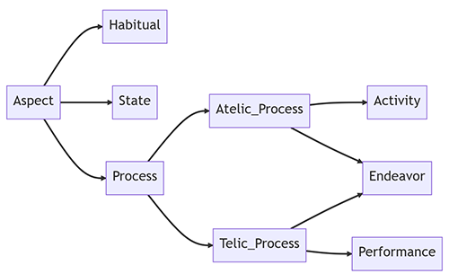

Note: For practical guidelines regarding the annotation of attributes with the INCEpTION platform, refer to the 
[Annotating attributes](#annotating-attributes)

<[back to the table of contents](#table-of-contents)>
#### Event nominals

As event nominals lack morphosyntactic information to determine their aspectual values, the default annotation is 
`process`. However, whenever the event nominal is part of an LVC, it may inherit the aspectual value the verb would have
been assigned.

```console
The bombing killed more than 25 people.

vn:attack-60.1 :has_aspect "process" .
```

<[back to the table of contents](#table-of-contents)>
#### Habitual

The aspectual `habitual` is used for recurring events.

```console
John runs every Wednesday.

vn:run-51.3.2-2-1 :has_aspect "habitual" .
```

<[back to the table of contents](#table-of-contents)>
#### State

The aspectual `state` is used for stative events (see the [Stative events](#stative-events) section). 

These include state verbs:

```console
John is a doctor.

:type :has_experiencer "John" .
:type :has_attribute "doctor" .
:type :has_aspect "state" .
```

Verbs modified by an ability modal:

```console
John can cook.

vn:cooking-45.3 :has_aspect "state" .
```

Thetic/predicative possession:

```console
John owns a car.

:own :has_aspect "state" .

---
 
This car belongs to John.

:own :has_aspect "state" .
```

<[back to the table of contents](#table-of-contents)>
#### Activity

The aspectual `activity` is used for events that haven't reached their ends.

These include the canonical progressive aspect:

```console
John is cooking.

vn:cooking-45.3 :has_aspect "activity" .
```

The imperfect:

```console
John has cooked.

vn:cooking-45.3 :has_aspect "activity" .
```

The periphrastic progressive aspect, such as "être en train de" in French:

```console
Luc est en train de cuisiner.

vn:cooking-45.3 :has_aspect "activity" .
```

The progressive aspect signified by adverbials:

```console
Luc cuisine en ce moment.

vn:cooking-45.3 :has_aspect "activity" .
```

The inchoative aspect:

```console
John began cooking.

vn:cooking-45.3 :has_aspect "activity" .
```

The prospective aspect:

```console
John is about to cook.

vn:cooking-45.3 :has_aspect "activity" .
```

The continuative aspect:

```console
John continued cooking.

vn:cooking-45.3 :has_aspect "activity" .
```

In some cases, it is impossible to decide whether the `activity` aspect must be assigned or if the event can be a 
telic one and go further down the lattice. In those cases, falling back to `atelic_process` is mandatory.

<[back to the table of contents](#table-of-contents)>
#### Endeavor

The aspectual `endeavor` is used for telic events, *i.e.*, for events that have reached their ends. 
However, it is not obvious that they have reached a result state. 

The only markers to look for are durative adverbials modifying the verb:

```console
John cooked for hours.

vn:cooking-45.3 :has_aspect "endeavor" .
```

Or the terminative aspect without proof of any event completion:

```console
John stopped cooking.

vn:cooking-45.3 :has_aspect "endeavor" .
```

<[back to the table of contents](#table-of-contents)>
#### Performance

Having gone thus far in the lattice, every event must receive the `performance` aspectual value.

```console
John cooked a wonderful meal.

vn:cooking-45.3 :has_aspect "performance" .
```

<[back to the table of contents](#table-of-contents)>
### Quantification

Quantification is used to assign a normalized numeric value to an entity.

Note: For practical guidelines regarding the annotation of quantification with the INCEpTION platform, refer to the 
[Annotating values](#annotating-values)

<[back to the table of contents](#table-of-contents)>
#### Usual cases

Just like temporal relations (see the [Temporal relations](#temporal-relations)) section, quantification can be 
symbolized with a number of derivative labels, namely `Measure{Exact,Min,Max,Fuzzy}`.  
Quantification can either be explicit or implicit.

| Proto-relation | Relation       | Example                                            | Annotation                    |
|----------------|----------------|----------------------------------------------------|-------------------------------|
| `Measure`\*    | `MeasureExact` | John owns a car / is driving his car.              | `"car" :has_measureexact "1"` |
|                | `MeasureMin`   | John owns cars / several cars / more than one car. | `"car" :has_measuremin "2"`   |
|                | `MeasureMax`   | John owns fewer than three cars.                   | `"car" :has_measuremax "2"`   |
|                | `MeasureFuzzy` | John owns around three cars.                       | `"car" :has_measurefuzzy "3"` |

\* `Measure` is the most coarse-grained quantification relation. This relation must be avoided as much as possible as the 
finer-grained relations are preferred. However, whenever the annotator is in doubt, they should fall back to this label.

<[back to the table of contents](#table-of-contents)>
#### Quantification in comparisons

Whenever quantification is expressed in comparative constructions, the scope must be adjusted. With those constructions, 
implicit predicates and/or arguments are common and must be represented (see 
the [Implicit predicates and arguments](#implicit-predicates-and-arguments) section). When
these implicit arguments are different instantiations of events/entities, they are distinct nodes from the explicit 
ones.

```console
John bought more flowers than Mary. (=John bought more flowers than Mary did [buy flowers]..)

vn:get-13.5.1 :has_agent "John" .
vn:get-13.5.1 :has_theme "flower" .
"flower" :has_measuremin "2" .
vn:get-13.5.1$implicit :has_agent "Mary" .
vn:get-13.5.1$implicit :has_theme "flower$implicit" .
"flower$implicit" :has_measuremin :unknown .
"2" :has_comparisonmin :unknown .
```

<[back to the table of contents](#table-of-contents)>
#### Quantification and superlatives

Quantification in superlatives works the same, *i.e.*, all the implicit predicates and arguments must be instantiated.

<!-- Cette représentation n'est pas satisfaisante -->

```console
John bought the most flowers. (=John bought the most flowers out of {everybody else, his siblings, his team members}).

vn:get-13.5.1 :has_agent "John" .
vn:get-13.5.1 :has_theme "flower" .
"flower" :has_measuremin "2" .
vn:get-13.5.1$implicit :has_agent "implicit_argument" .
vn:get-13.5.1$implicit :has_theme "flower$implicit" .
"flower$implicit" :has_measuremin :unknown .
"2" :has_comparisonmin :unknown .
```

#### Other uses of quantification

The expression of quantification can take several forms. Ordinal entities for instance give way to `:ordinal` nodes with
the relations `Ordinal` and `Value`.

```console
She is the duke's fourth daughter and tenth child.

"daughter" :has_ordinal :ordinal$1 .
:ordinal$1 :has_value "4" .
"child" :has_ordinal :ordinal$2 . 
:ordinal$2 :has_value "10" .
```

Ordinal entities can appear in temporal expressions.

```console
The castle was built during the 12th century.

vn:build-26.1-1 :has_product "castle" .
vn:build-26.1-1 :has_timeduration "century" . 
"century" :has_ordinal :ordinal . 
:ordinal :has_value "12" .
```

<!-- TODO: other cases -->
Frequency can also be considered as a quantification process. 
See the [`TimeFrequency`: a special case](#timefrequency-a-special-case) section for more information.

<[back to the table of contents](#table-of-contents)>
### Polarity (and scope)

Polarity can receive one of two values: `negative` or `positive`. **However, to reduce the number of annotations needed,
`positive` polarity can be considered the default annotation and not be annotated.**

The scope of the negation must be taken into account, especially when interacting with modality. As explained in
the [Attribute nodes and `Argument{In,Out}` relations](#attribute-nodes-and-argumentinout-relations) section,
attributes should be considered as reified nodes by default. In fact, polarity can either be seen as the attribute 
acting as a relation (*i.e.*, `:has_polarity`) or as the attribute node `:polarity` with the `Argument{In,Out}` 
relations. Doing so allows the annotator to address scope whenever needed.

The first two examples are demonstrations of cases where reifying seems pointless:

```console
John is cooking.

vn:cooking-45.3 :has_agent "John" .
vn:cooking-45.3 :has_polarity "positive" .

---

John is not cooking.

vn:cooking-45.3 :has_agent "John" .
vn:cooking-45.3 :has_polarity "negative" .
```

On the other hand, the next three examples show how scope is important, especially when modality and 
negation interact or when negation is doubled.

```console
John is not not cooking.

vn:cooking-45.3 :has_agent "John" .
:polarity$1 :has_argumentin vn:cooking-45.3 .
:polarity$1 :has_argumentout "negative" .
:polarity$2 :has_argumentin :polarity$1 .
:polarity$2 :has_argumentout "negative" .

--- 

John does not have to cook.

vn:cooking-45.3 :has_agent "John" .
:modality :has_argumentin vn:cooking-45.3 .
:modality :has_argumentout "obligation" .
:modality :has_polarity "negative" .

---

John has to not cook.

vn:cooking-45.3 :has_modality "obligation" .
vn:cooking-45.3 :has_polarity "negative" .
```

Polarity concerns adjectives as well.

```console
What John did was not right.

pb:right.02 :has_polarity "negative" .

---
 
What John did was unfair.

pb:fair.01 :has_polarity "negative" .
```

Note: For practical guidelines regarding the annotation of polarity with the INCEpTION platform, refer to the 
[Annotating attributes](#annotating-attributes) and [Reifying attribute nodes](#reifying-attribute-nodes) sections.

<[back to the table of contents](#table-of-contents)>
### Modality (and scope)

Modality expresses the relationship between a given utterance and its truth value.  
Modality can receive one of six values: `obligation`, `capacity`, `wish`, `suggestion`, `uncertainty`, and `temporality`.

The scope of modals must be taken into account, especially when interacting with negation. As explained in
the [Attribute nodes and `Argument{In,Out}` relations](#attribute-nodes-and-argumentinout-relations) section,
attributes should be considered as reified nodes by default. In fact, modality can either be seen as the attribute 
acting as a relation (*i.e.*, `:has_modality`) or as the attribute node `:modality` with the `Argument{In,Out}` 
relations. Doing so allows the annotator to address scope whenever needed (see the [Polarity (and scope)](#polarity-and-scope)
section for such examples.

Note: For practical guidelines regarding the annotation of modality with the INCEpTION platform, refer to the 
[Annotating attributes](#annotating-attributes) and [Reifying attribute nodes](#reifying-attribute-nodes) sections.

<[back to the table of contents](#table-of-contents)>
#### Obligation

The `obligation` modal value is used for deontic modality.

```console
John must attend his classes.

vn:attend-107.4-1 :has_modality "obligation" .
```

<[back to the table of contents](#table-of-contents)>
#### Capacity

The `capacity` modal value is used when expressing ability.

```console
John can cook.

vn:cooking-45.3 :has_modality "capacity" .
```

<[back to the table of contents](#table-of-contents)>
#### Wish

The `wish` modal value is used when expressing volition.

```console
John wants to cook.

vn:cooking-45.3 :has_modality "wish" .
```

<[back to the table of contents](#table-of-contents)>
#### Suggestion

The `suggestion` modal value is used when expressing desirability.

```console
John should cook more often.

vn:cooking-45.3 :has_modality "suggestion" .
```

<[back to the table of contents](#table-of-contents)>
#### Uncertainty

The `uncertainty` modal value is used when expressing epistemic modality.

```console
John might be cooking.

vn:cooking-45.3 :has_modality "uncertainty" .
```

<[back to the table of contents](#table-of-contents)>
#### Temporality

The `temporality` modal value is used to denote frequency.
<!-- Do we keep this? Not really a modal value -->

```console
John cooks for us sometimes.

vn:cooking-45.3 :has_modality "temporality" .
```

<[back to the table of contents](#table-of-contents)>
### Degree

The `Degree` attribute is used to scale a property that is modified.

Note: For practical guidelines regarding the annotation of degree with the INCEpTION platform, refer to the 
[Annotating attributes](#annotating-attributes) section.

<[back to the table of contents](#table-of-contents)>
#### Intensifiers and downtoners

Usually, `Degree` can take one of two values: `intensifier` or `downtoner`.

```console
John is very fast.

pb:fast.04 :has_degree "intensifier" .

---

John is a little slow.

pb:fast.04 :has_degree "downtoner" .
```

<[back to the table of contents](#table-of-contents)>
#### Degree-consequence constructions

Degree-consequence constructions are annotated like the following example (borrowed from Bonial et al. (2018)):

```console
The smell is so terrible, you want to throw up.

:property :has_theme "smell" .
:property :has_property pb:terrible.01 . 
:property :has_degree "intensifier"
:property :has_consequence fn:Excreting .
fn:Excreting :has_agent "you" .
```

<[back to the table of contents](#table-of-contents)>
## Coreference and anaphora

Coreference indicates that two or more expressions have the same referent, *i.e.*, they refer to the same entity or event.

Note: For practical guidelines regarding the annotation of coreference with the INCEpTION platform, refer to the 
[Annotating relations](#annotating-relations) section.

<[back to the table of contents](#table-of-contents)>
### Event coreference

Coreference can occur between events.

```console
The bombing killed more than 25 people. It occurred in broad daylight.

vn:attack-60.1$2 :is_sameas vn:attack-60.1$1 .
```

Whenever there is a coreference, every mention of the chain must bear the same class.

<[back to the table of contents](#table-of-contents)>
### Entity coreference

Coreference can occur between entities.

```console
John swam for hours. Then, he went straight back home.

"he" :is_sameas "John" .
```

<[back to the table of contents](#table-of-contents)>
### Possessive anaphora

An expression is anaphoric when it has an antecedent. However, contrary to coreference, the anaphoric mention and its
antecedent do not share the same referent. This is the case for possessive anaphora, as in "John broke his bike", where
"his" refers indirectly to the bike's owner, *i.e.*, "John". In such cases, there are two scenarios: either the noun 
determined by the possessive determiner is an event or it is an object. In the latter case, the object and its 
possessor must be linked with an `own` node, just like thetic/predicational possession:

```console
John broke his bike.

:own :has_pivot "John" .
:own :has_theme "bike" .
```

In the former case (when the noun is an event), the antecedent must be linked to said event with the appropriate relation.
Moreover, if the event nominal co-refers with a preceding mention, a `SameAs` relation must also be annotated 
(see the [Event coreference](#event-coreference) section).

```console
John was apprehended by the police yesterday. His arrest lasted only a few minutes.

vn:prosecute-33.2$1 :has_patient "John" .
vn:prosecute-33.2$2 :has_patient "John" (from "his") .
vn:prosecute-33.2$2 :is_sameas vn:prosecute-33.2$1 .
```

<[back to the table of contents](#table-of-contents)>
## Annotation cheatsheet

In this section, we provide a practical guide for INCEpTION as well as a cheatsheet to ease the annotation process.

<[back to the table of contents](#table-of-contents)>
### How to INCEpTION: a practical guide

INCEpTION is an annotation platform developed by Klie et al. (2018). It was convenient enough to allow us to annotate
texts for MR4AP. INCEpTION is organised in annotation layers and tagsets. **We provide all the necessary resources 
[here](./inception_settings).** 
We describe how to get started with INCEpTION [there]() (importing layers, tagsets, and texts). 
<!-- TODO: add the aforementioned part of the guidelines -->

This section is dedicated to how to annotate the different elements we described throughout the guidelines.

<[back to the table of contents](#table-of-contents)>
#### Getting started

To start annotating MR4APs using INCEpTION, you must first:
* Download and setup [INCEpTION](https://inception-project.github.io/) on your computer,
* Create a new project,
* Download the necessary layers and tagsets [here](./inception_settings),
* Import them in your project and enable them,
* Import the raw text data files you want to start annotating (remember to add asterisks to be able to annotate 
  implicit elements, see [next section](#make-use-of-the-asterisks)),
* You are ready to rumble!

Once a text is finished, you can mark it as such clicking on the lock.
Annotated data can be exported in a various range of formats.

<[back to the table of contents](#table-of-contents)>
#### Make use of the asterisks

Each text goes with some asterisks at the end. These are used in a number of cases:
* To annotate stative events when no lexical item can be annotated (see the [Annotating stative events](#annotating-stative-events) section),
* To annotate implicit arguments and predicates (see the [Annotating implicit elements](#annotating-implicit-elements)),
* To annotate reified attribute nodes (see the [Reifying attribute nodes](#reifying-attribute-nodes) section),
* To annotate implicit values (see the [Annotating values](#annotating-values) section),
* To create a `Document Creation Time` node to temporally anchor predicates.

<[back to the table of contents](#table-of-contents)>
#### Annotating entities

Annotating entities is as simple as it gets:
* Select the `Entities` layer (top right corner),
* Highlight the span of text you wish to annotate,
* Give the annotation a tag from the [ontology](#semantic-typing) (beginning to fill the `Tag` field offers suggestions),
* You can edit your annotation anytime.

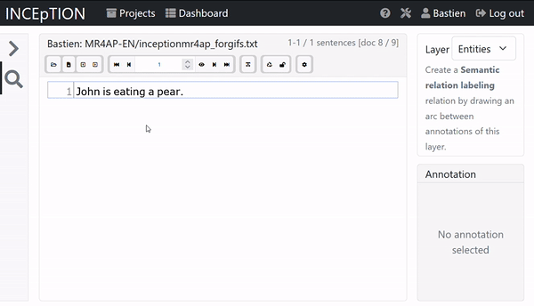

To speed up the process, key bindings for the most frequent tags exist.  
We recommend annotating entities before anything else. 

<[back to the table of contents](#table-of-contents)>
#### Annotating predicates

Annotating predicates works the same as annotating entities with a twist:
* Select the `Entities` layer (top right corner),
* Highlight the span of text you wish to annotate,
* Assign the annotation a semantic class from any resource; you can use the 
  [Unified Verb Index (UVI)](https://uvi.colorado.edu/uvi_search) to find relevant predicate classes (beginning to fill 
  the `Tag` field offers suggestions),
* You can edit your annotation anytime.

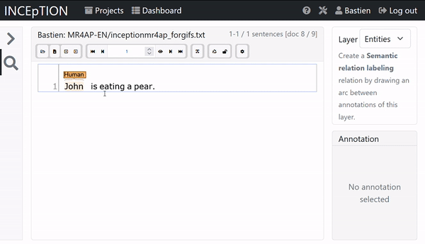

We recommend annotating predicates early during the annotation process.

<[back to the table of contents](#table-of-contents)>
#### Annotating implicit elements

Entities and predicates can be implicit. In such cases, the annotator should make use of the asterisks at the end of the
document to instantiate the implicit element. Typically, in languages for which subjects are embedded in the conjugated
verb (such as Italian, Spanish, or Arabic), nodes might need to be instantiated. 

Take for instance the segment "Lavorerai domani" and compare it with its English translation: "You will work tomorrow".
In both cases, we need to have the triple `:work :has_agent "you"` annotated somehow. To do so (in Italian):
* Annotate an asterisk at the end of the document with a `Human` entity,
* Link the `Work` event node to the newly created `Human` entity with an `Agent` relation.

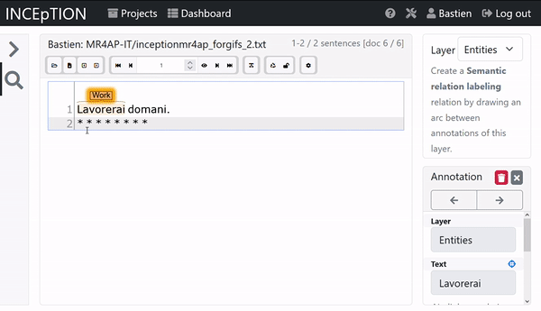

The same goes for any implicit element the annotator wishes to represent.

<[back to the table of contents](#table-of-contents)>
#### Annotating stative events

[Stative events](#stative-events) do not denote actions and are not verbal. As such, there might not be tokens on which
an annotation can be added. For instance, copulae may not be present in nominal sentences in Arabic. Take this segment: "جون مهندس"
("ǧūn muhandis", "John is an engineer", lit. "John engineer"). No visible copula is present to link both elements with a
`Type` node, hence the need to annotate such cases like this:
* Annotate "John" as a `Human` entity,
* Annotate "engineer" as a `Function` entity,
* Annotate an asterisk at the end of the document as a `Type` predicate,
* Link the `Human` entity as the `Experiencer`,
* Link the `Function` entity as the `Attribute`.

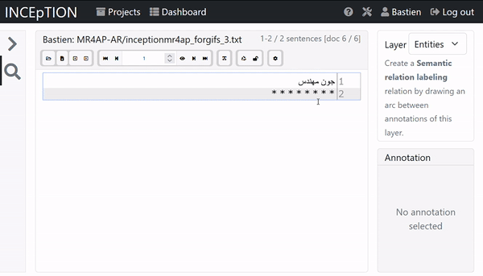

The same goes for every stative event when no surface tokens can be used.

<[back to the table of contents](#table-of-contents)>
#### Annotating relations

Annotating relations works once entities and predicates exist in your document:
* Click on an annotation and hold,
* Drag the mouse to another annotation,
* In the `Relation` field, choose one from the list,
* You can edit your annotation anytime.

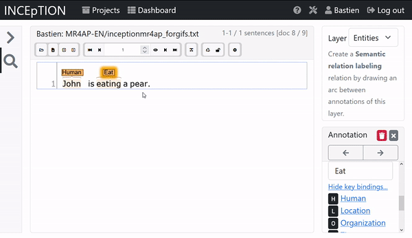

**Relations are to be taken into account at both the sentence and the document levels.**  
To speed up the process, key bindings for the most frequent tags exist.  
We recommend annotating relations after all entities and predicates have been identified. 

<[back to the table of contents](#table-of-contents)>
#### Annotating attributes

Attributes are usually superimposed on predicates and entities annotations:
* Select the `Attributes` layer (top right corner),
* Highlight the span of text you wish to annotate,
* Assign the annotation an attribute in the `Attribute` field (beginning to fill the `Tag` field offers suggestions),
* You can edit your annotation anytime.

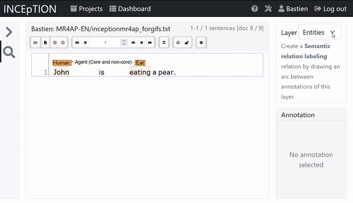

To speed up the process, key bindings for the most frequent attributes exist.  
We recommend annotating attributes after everything else. 

<[back to the table of contents](#table-of-contents)>
#### Annotating values

Some annotations necessitate to have values assigned to them. This is the case for quantification.
Take for instance the segment "John ate apples before dinner". The correct way to annotate the number associated to
'apples' is the following triple: `"apples" :has_measuremin "2"`. To do so with INCEpTION:
* Annotate the `Ingredient` entity "apples",
* Annotate an asterisk at the end of the document as a `Measure` entity,
* Create a `MeasureMin`relation starting from the `Ingredient` entity to the `Measure` entity,
* Select the `Values` layer (top right corner),
* Annotate the asterisk bearing the `Measure` tag with a value annotation,
* Set the correct value using the `Value` field.

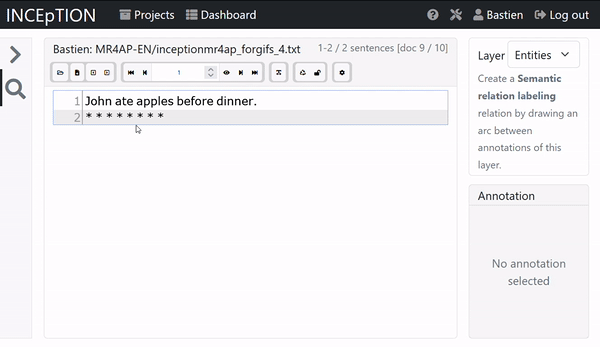

<[back to the table of contents](#table-of-contents)>
#### Reifying attribute nodes

As explained in [this section](#attribute-nodes-and-argumentinout-relations), attributes may give way to reifications.
Whenever needed, the annotator should make use of the asterisks at the end of the text. Take for instance the segment
"John does not have to cook Mary dinner". The negation concerns the deontic modal value expressed with "have to", but 
does not concern the verb "cook" (compare with "John has to not cook Mary dinner"). Attributes superimposed on
predicates can't be the endpoints of relations. Thus, the correct way to annotate the triples 
`vn:cooking-45.3 :has_modality "obligation"` and `:modality :has_polarity "negative"` is:
* Annotate the cooking event with the `Cook` predicate class,
* Annotate an asterisk with a `Modality` entity node,
* Assign an attribute `modality:obligation` to said `Modality` node,
* Assign an attribute `polarity:negative` to said `Modality` node,
* Link the `Modality` node to the `Cook` node with an `ArgumentIn` relation.

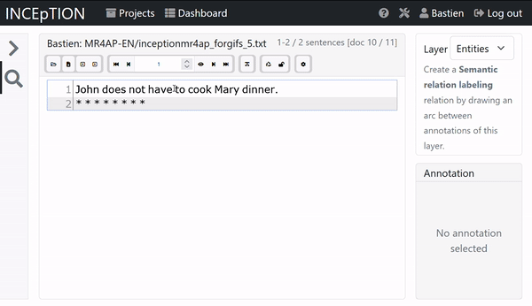

This method can be extended to any attribute node.

<[back to the table of contents](#table-of-contents)>
### Relations and values

| Relation type         | Relation          | Value                                                                                           |
|-----------------------|-------------------|-------------------------------------------------------------------------------------------------|
| **Core and non-core** | `Agent`           | Entity                                                                                          |
|                       | `Pivot`           | Entity                                                                                          |
|                       | `Cause`           | Predicate or entity                                                                             |
|                       | `Theme`           | Entity                                                                                          |
|                       | `Patient`         | Entity                                                                                          |
|                       | `Topic`           | Predicate or entity                                                                             |
|                       | `Recipient`       | Entity                                                                                          |
|                       | `Beneficiary`     | Entity                                                                                          |
|                       | `Experiencer`     | Entity                                                                                          |
|                       | `Stimulus`        | Predicate or entity                                                                             |
|                       | `Result`          | Predicate or entity                                                                             |
|                       | `Attribute`       | Entity                                                                                          |
|                       | `Product`         | Predicate or entity                                                                             |
|                       | `Location`        | Entity                                                                                          |
|                       | `LocationExact`   | Entity                                                                                          |
|                       | `LocationFuzzy`   | Entity                                                                                          |
|                       | `LocationSpan`    | Entity                                                                                          |
|                       | `Source`          | Predicate or entity                                                                             |
|                       | `Destination`     | Predicate or entity                                                                             |
|                       | `Manner`          | Adverbial                                                                                       |
|                       | `Instrument`      | Entity                                                                                          |
|                       | `Material`        | Entity                                                                                          |
|                       | `Value`           | Entity                                                                                          |
|                       | `Asset`           | Entity                                                                                          |
|                       | `Event`           | Predicate                                                                                       |
|                       | `Relative`        | Predicate or entity                                                                             |
|                       | `Unknown`         | `unknown` (used to mark polar and alternative questions)                                        |
| **Temporal**          | `Time`            | Predicate or DCT                                                                                |
|                       | `TimeExact`       | Predicate or DCT                                                                                |
|                       | `TimeMin`         | Predicate or DCT                                                                                |
|                       | `TimeMax`         | Predicate or DCT                                                                                |
|                       | `TimeFuzzy`       | Predicate or DCT                                                                                |
|                       | `TimeDuration`    | Predicate or DCT                                                                                |
|                       | `TimeFrequency`   | Predicate                                                                                       |
| **Discourse**         | `Cause`           | Predicate or entity                                                                             |
|                       | `Consequence`     | Predicate                                                                                       |
|                       | `Opposition`      | Predicate                                                                                       |
|                       | `Conclusion`      | Predicate                                                                                       |
|                       | `Comparison`      | Predicate or entity                                                                             |
|                       | `ComparisonExact` | Predicate or entity                                                                             |
|                       | `ComparisonMin`   | Predicate or entity                                                                             |
|                       | `ComparisonMax`   | Predicate or entity                                                                             |
|                       | `ComparisonFuzzy` | Predicate or entity                                                                             |
|                       | `Condition`       | Predicate                                                                                       |
|                       | `Illustration`    | Predicate                                                                                       |
|                       | `Explanation`     | Predicate                                                                                       |
|                       | `Purpose`         | Predicate or entity                                                                             |
|                       | `Restriction`     | Predicate                                                                                       |
|                       | `Whatever`        | Predicate                                                                                       |
| **Coreference**       | `SameAs`          | Predicate or entity                                                                             |
| **Logic**             | `Addition`        | Between coordinated elements (conjunction)                                                      |
|                       | `Alternative`     | Between coordinated elements (disjunction)                                                      |
| **Attributes**        | `Type`            | Any semantic type from Emvista's ontology (see the [Semantic typing](#semantic-typing) section) |
|                       |                   | `feminine` (for `Thing/Concrete/Animate/Livingbeing` semantic type only)                        |
|                       |                   | `masculine` (for `Thing/Concrete/Animate/Livingbeing` semantic type only)                       |
|                       |                   | `question-closed` (for polar questions)                                                         |
|                       |                   | `question-choice` (for alternative questions)                                                   |
|                       |                   | `question-open` (for variable questions)                                                        |
|                       | `Polarity`        | `negative`                                                                                      |
|                       |                   | `positive`                                                                                      |
|                       | `Aspect`          | `process`                                                                                       |
|                       |                   | `habitual`                                                                                      |
|                       |                   | `state`                                                                                         |
|                       |                   | `activity`                                                                                      |
|                       |                   | `atelic_process`                                                                                |
|                       |                   | `endeavor`                                                                                      |
|                       |                   | `performance`                                                                                   |
|                       | `Modality`        | `obligation`                                                                                    |
|                       |                   | `capacity`                                                                                      |
|                       |                   | `wish`                                                                                          |
|                       |                   | `suggestion`                                                                                    |
|                       |                   | `uncertainty`                                                                                   |
|                       |                   | `temporality`                                                                                   |
|                       | `Measure`         | Literal value                                                                                   |
|                       | `MeasureExact`    | Literal value                                                                                   |
|                       | `MeasureMin`      | Literal value                                                                                   |
|                       | `MeasureMax`      | Literal value                                                                                   |
|                       | `MeasureFuzzy`    | Literal value                                                                                   |
|                       | `Ordinal`         | Literal value                                                                                   |
| **Reified nodes**     | `ArgumentIn`      | The source node                                                                                 |
|                       | `ArgumentOut`     | The target node                                                                                 |


<[back to the table of contents](#table-of-contents)>
### Complete example

In this section, we put forward a fully annotated example exhibiting most phenomena described in these guidelines.

```console
Luke and John are singing songs. As a result, Mary cannot sleep. She will reprimand them tomorrow morning.

vn:performance-26.7 :has_theme "song" .
vn:performance-26.7 :has_agent :addition .
:addition :has_addition "Luke" .
"Luke" :has_type em:Thing/Concrete/Animate/Livingbeing/Human .
"Luke" :has_type "masculine" .
"John" :has_type em:Thing/Concrete/Animate/Livingbeing/Human .
"John" :has_type "masculine" .
:addition :has_addition "John" .
"song" :has_measuremin "1" .
"song" :has_type em:Thing/Abstract/Product/Artwork/Music .
vn:performance-26.7 :has_polarity "positive" .
vn:performance-26.7 :has_aspect "activity" .
vn:performance-26.7 :has_timeexact "DCT" .
vn:performance-26.7 :has_consequence vn:snooze-40.4 .
vn:snooze-40.4 :has_cause vn:performance-26.7 .
vn:snooze-40.4 :has_agent "Mary" .
"Mary" :has_type em:Thing/Concrete/Animate/Livingbeing/Human .
"Mary" :has_type "feminine" .
vn:snooze-40.4 :has_aspect "state" .
vn:snooze-40.4 :has_modality "capacity" .
"capacity" :has_polarity "negative" .
vn:snooze-40.4 :has_timeexact "DCT" .
vn:snooze-40.4 :has_timemax vn:judgment-33 .
vn:judgment-33 :has_agent "she" .
vn:judgment-33 :has_theme "them" .
vn:judgment-33 :has_timemin "DCT+1dayt06:00:00" .
vn:judgment-33 :has_timemax "DCT+1dayt12:00:00" .
vn:judgment-33 :has_polarity "positive" .
vn:judgment-33 :has_aspect "performance" .
"Mary" :is_sameas "she" .
:addition :is_sameas "them" .
```

The corresponding visual graph from 
[MR4AP: Meaning Representation for Application Purposes](../paper/mr4ap_giordano_lopez_dmr2023.pdf)'s paper: 

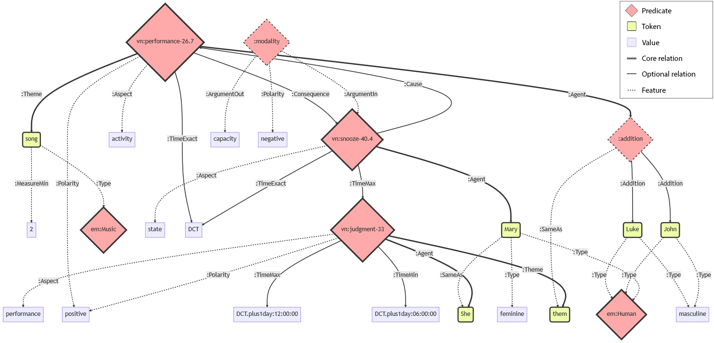

The corresponding annotated document on the INCEpTION platform:

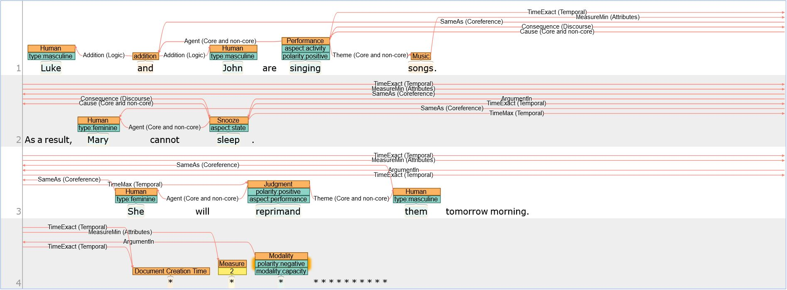