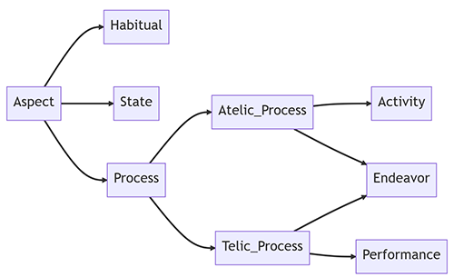
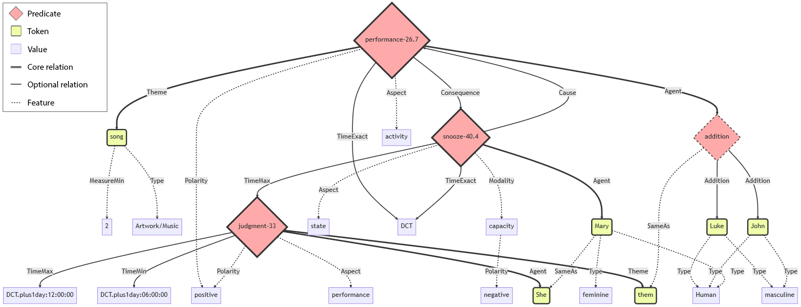

Meaning Representation for Application Purposes - Annotation Guidelines
=======================================================================

**May 11, 2023**

Authors: *Bastien Giordano, Cédric Lopez*

## Table of contents
1. [Introduction to MR4AP](#introduction-to-mr4ap)
2. [Predicate-argument structure](#predicate-argument-structure)
   1. [Events and entities](#events-and-entities)
      1. [Dynamic events](#dynamic-events)
      2. [Stative events](#stative-events)
      3. [Adjectives: predicates?](#adjectives-predicates)
      4. [Reified predicates](#reified-predicates)
   2. [Relation types](#relation-types)
      1. [Core and non-core relations](#core-and-non-core-relations)
      2. [Temporal relations](#temporal-relations)
      3. [Discourse relations](#discourse-relations)
      4. [Coreference relations](#coreference-relations)
3. [Multiword expressions (MWEs)](#multiword-expressions-mwes)
   1. [Entities](#entities)
   2. [Light-verb constructions (LVCs)](#light-verb-constructions-lvcs)
   3. [Verb-particle constructions (VPCs)](#verb-particle-constructions-vpcs)
   4. [Idioms](#idioms)
4. [Questions](#questions)
   1. [Polar questions](#polar-questions)
   2. [Alternative questions](#alternative-questions)
   3. [Variable questions](#variable-questions)
5. [MR4AP attributes](#mr4ap-attributes)
   1. [Semantic typing](#semantic-typing)
      1. [Named Entities and Word Senses](#named-entities-and-word-senses)
      2. [Gender](#gender)
      3. [Question types](#questions)
   2. [Aspect](#aspect)
      1. [Event nominals](#event-nominals)
      2. [Habitual](#habitual)
      3. [State](#state)
      4. [Activity](#activity)
      5. [Endeavor](#endeavor)
      6. [Performance](#performance)
   3. [Quantification](#quantification)
   4. [Polarity (and scope)](#polarity-and-scope)
   5. [Modality (and scope)](#modality-and-scope)
      1. [Obligation](#obligation)
      2. [Capacity](#capacity)
      3. [Wish](#wish)
      4. [Suggestion](#suggestion)
      5. [Uncertain](#uncertainty)
      6. [Temporal](#temporality)
6. [Coreference and anaphora](#coreference-and-anaphora)
   1. [Event coreference](#event-coreference)
   2. [Entity coreference](#entity-coreference)
   3. [Possessive anaphora](#possessive-anaphora)
7. [Annotation cheatsheet](#annotation-cheatsheet)
   1. [Relations and values](#relations-and-values)
   2. [Complete example](#complete-example)

--- 

## Introduction to MR4AP

MR4AP is a meaning representation formalism designed by Emvista. Being used in an industrial context, it was thought 
with a definitive applicative aim. As such, two watchwords guided its design:
* **Genericity**: The formalism must be able to detach itself from the surface form in order to transcribe the meaning 
despite syntactic idiosyncrasies. It also must be applied regardless of the language one wishes to work with.
* **Explicitness**: The formalism uses directed graphs and as such, its explicitness is partly based upon the naming of the
relations used: having relations too coarse-grained, too fine-grained, or opaque is detrimental to its efficient 
understanding. Moreover, all entities must be semantically typed to avoid having to gloss their meanings.

MR4AP has been designed with the firm belief that a meaning representation formalism, to be complete, 
cannot stop with representing content at the sentence level, but must be extended to take into account 
the entirety of documents. Moreover, still in this search for completeness, all levels of relations must be 
represented: temporality, discourse, and coreference.

<[back to the table of contents](#table-of-contents)>
## Predicate-argument structure

MR4AP follows a predicate-argument structure. As such, the core of its design revolves around the identification 
of predicates and their arguments.

Note: MR4AP does not cling to any resource in particular. The vocabulary used to denote predicate classes may come from 
diverse resources, such as VerbNet, FrameNet, or PropBank.

<[back to the table of contents](#table-of-contents)>
### Events and entities

MR4AP treats the predicate-argument structure as an event-entity structure.
Events are split into two categories:
* **Dynamic events**: "actions" in the neo-Davidsonian sense, or "processes".
* **Stative events**: states and changes of state, possession, location, existential predication.

<[back to the table of contents](#table-of-contents)>
#### Dynamic events

Dynamic events denote processes or actions. Such events are typically denoted by verbs and nouns.
The following sentence all express the logical expression `arrest(police,John)`:

```console
The police arrested John.
The police, who arrested John, (...).
The police arresting John (...).
The police wanted to arrest John.
John's arrestation by the police (...).
```

MR4AP transposes these logical representations into graph representations using named relations to link events and their
relative entities (see [Relation types](#relation-types) section).

<[back to the table of contents](#table-of-contents)>
#### Stative events

Even though stative events are considered as events as well, they do not denote actions. 
Stative events include the following:

| Stative event type        | Example                       |
|---------------------------|-------------------------------|
| Thetic possession         | John has two cats.            |
| Predicational possession  | These cats are John's.        |
| Predicational location    | John's cats are on the table. |
| Predicational property    | John's cats are black.        |
| State and change of state | John became a doctor.         |
| Existential predication   | There were cats on the table. |

<[back to the table of contents](#table-of-contents)>
#### Adjectives: predicates?

Adjectives can either be attributive or predicate. In the former case (as in "the quiet cat"), the adjective must be 
treated as a property of the noun it modifies (i.e., `"cat" @Property: "quiet"`). However in the latter case (as in 
"the cat is quiet"), the noun must be treated as an argument of the predicate adjective (i.e., `quiet-04 @Theme: "cat"`).

This difference in treatment is useful because the predicate adjective can later receive modal or aspectual modifications.
In languages like English or French, linking verbs / copulas are used. Thus, the said verbal element can be modified 
("the cat {is,was,might have been,should be,will be} gentle"). However in other languages such as Arabic, this verbal 
element might or might not appear depending on the aspect:

```console
القط هادئ
(al-qiṭṭu hādiʾ, lit. "the cat quiet", transl. "the cat is quiet")

---

كان القط هادئ
(kāna al-qiṭṭu hādiʾ, lit. "was the cat quiet", transl. "the cat was quiet")
```

<[back to the table of contents](#table-of-contents)>
#### Reified predicates

Reified predicates are used for coordination:
* `addition` for conjunctions,
* `alternative` for disjunctions.

```console
John loves swimming and running.
addition @Addition: run-51.3.2-1 ("swimming")
addition @Addition: run-51.3.2-2-1 ("running")

---
                    
On Monday, John either swims or runs.
alternative @Alternative: run-51.3.2-1 ("swims")
alternative @Alternative: run-51.3.2-2-1 ("runs")
```

More than two elements can be coordinated. Coordinated elements can be anything.

```console
John loves swimming, cycling and running.
addition @Addition: run-51.3.2-1 ("swimming")
addition @Addition: drive-11.5 ("cycling")
addition @Addition: run-51.3.2-2-1 ("running")

---
                             
John loves the lake, his bike and his running shoes.
addition @Addition: "lake"
addition @Addition: "bike"
addition @Addition: "running shoes"
```

<[back to the table of contents](#table-of-contents)>
### Relation types

In its search of explicitness, MR4AP requires every relation to be named. There are different types of relations.

<[back to the table of contents](#table-of-contents)>
#### Core and non-core relations

Core relations symbolize mandatory/prototypical predicate arguments relations, as can be detailed in some 
resources like VerbNet.

```console
John ate the apple.

eat-39.1 @Agent:   "John"
eat-39.1 @Patient: "apple"

eat-39.1 @ Agent [+animate] V Patient [+comestible]
```

Non-core relations symbolize optional predicate arguments relations.

```console
John ate the apple with a fork.

eat-39.1 @Instrument: "fork"
```

Here is an exhaustive list of core and non-core relations along with examples.  
Those must be read from the underlined token to the bold one with the relation 
(e.g., **John** <ins>ate</ins> an apple -> `"eat" @Agent: "John"`).

| Relation        | Example                                                                     |
|-----------------|-----------------------------------------------------------------------------|
| `Agent`         | **John** <ins>ate</ins> an apple.                                           |
| `Cause`         | **John** made Mary <ins>eat</ins> an apple.                                 |
| `Theme`         | John <ins>ordered</ins> **sushi**.                                          |
| `Patient`       | John <ins>ate</ins> an **apple**.                                           |
| `Topic`         | John <ins>read</ins> a **book**.                                            |
| `Recipient`     | John <ins>sent</ins> a letter to **Mary**.                                  |
| `Beneficiary`   | John <ins>helped</ins> **Mary**.                                            |
| `Experiencer`   | **John** <ins>saw</ins> Mary.                                               |
| `Stimulus`      | John <ins>saw</ins> **Mary**.                                               |
| `Attribute`     | John <ins>praised</ins> the **courage** of the volunteers.                  |
| `Product`       | John <ins>built</ins> a **house**.                                          |
| `Location`      | John <ins>built</ins> a house in **France**.                                |
| `LocationExact` | John <ins>built</ins> a house...                                            |
| `LocationSpan`  | John <ins>found</ins> a treasure between Marseille **and** Montpellier.\*   |
| `LocationFuzzy` | John <ins>built</ins> a house somewhere in **France**.                      |
| `Source`        | John <ins>emptied</ins> the trash from the **trash can** into the dumpster. |
| `Destination`   | John <ins>emptied</ins> the trash from the trash can into the **dumpster**. |
| `Instrument`    | John <ins>traveled</ins> on his **bike**.                                   |
| `Manner`        | John **quickly** <ins>built</ins> a house.                                  |
| `Material`      | John <ins>built</ins> a house in **bricks**.                                |
| `Value`         | John <ins>estimated</ins> the probability at **20%**.                       |
| `Asset`         | John <ins>billed</ins> Mary for 100 **euros**.                              |
| `Event`         | John <ins>attended</ins> the **meeting**.                                   |
| `Unknown`       | \**                                                                         |

\* `LocationSpan` includes at least two elements. As specified earlier, conjunctions are modelized using `addition` nodes 
(see [Reified predicates](#reified-predicates) section), hence the bold "and".  
\** `Unknown` is only used to mark polar and alternative questions (see [Questions](#questions) section).

<[back to the table of contents](#table-of-contents)>
#### Temporal relations

Temporal relations are relations symbolizing temporality.

```console
John left before Mary entered the room.

leave @TimeMax: "enter"
```

Temporality can also be an attribute when it does not connect two predicates.

```console
John worked yesterday.

work @TimeMin: 2023-05-04@00:00
work @TimeMax: 2023-05-04@23:59
```

Here is an exhaustive list of temporal relations with examples.  
Those must be read from the underlined token to the bold one with the relation 
(e.g., Before Mary **entered** the room, John <ins>left</ins> -> `"leave" @TimeMax: "enter"`).

| Relation         | Example                                                          |
|------------------|------------------------------------------------------------------|
| `Time`           | When Mary **entered** the room, John <ins>left</ins>.            |
| `TimeExact`      | As soon as Mary **entered** the room, John <ins>left</ins>.      |
| `TimeMin`        | After Mary **entered** the room, John <ins>left</ins>.           |
| `TimeMax`        | Before Mary **entered** the room, John <ins>left</ins>.          |
| `TimeFuzzy`      | Around the time Mary **entered** the room, John <ins>left</ins>. |
| `TimeDuration`   | As Mary **entered** the room, John <ins>left</ins>.              |

<[back to the table of contents](#table-of-contents)>
#### Discourse relations

Discourse relations are relations symbolizing discourse connections between predicates. 
They occur both at the sentence and the document level.

```console
If John was working, he would have helped Mary.

help-72.1-1 @Condition: work-73.2

---

John was not working yesterday. As a consequence, he could not help Mary.

help-72.1-1 @Consequence: work-73.2
work-73.2 @Cause: help-72.1-1
```

Here is an exhaustive list of discourse relations with examples.  
Those must be read from the underlined token to the bold one with the relation 
(e.g., If John wants to **leave**, he has to <ins>ask</ins> first -> `"ask" @Condition: "leave"`).  
Bidirectional relations are read... in both directions 
(e.g., John <ins>**asked**</ins> first, so he <ins>**left**</ins> -> `"leave" @Cause: "ask"` & `"ask" @Consequence: "leave"`).

| Bi- / Unidirectional | Relation                  | Example                                                                                           |
|----------------------|---------------------------|---------------------------------------------------------------------------------------------------|
| Bidirectional        | `Cause`/`Consequence`     | John <ins>**asked**</ins> first, so he <ins>**left**</ins>.                                       |
|                      | `Opposition`/`Opposition` | John <ins>**asked**</ins> first, but he didn't <ins>**leave**</ins>.                              |
| Unidirectional       | `Conclusion`              | John has been <ins>working</ins> with precision for years. In short, he **deserves** a promotion. |
|                      | `Comparison`              | John always <ins>works</ins> with precision. Conversely, Mary doesn't **do** much.                |
|                      | `Condition`               | If John wants to **leave**, he has to <ins>ask</ins> first.                                       |
|                      | `Explanation`             | Writing this report will <ins>take</ins> time, especially since John is not **working**.          |
|                      | `Illustration`            | John <ins>works</ins> with precision. For example, he **wrote** this excellent report.            |
|                      | `Purpose`                 | John wants to <ins>leave</ins> to **attend** his medical appointment.                             |
|                      | `Restriction`             | John <ins>left</ins> even though he didn't **ask** first.                                         |
|                      | `Whatever`                | No matter that John **asked**, he can't <ins>leave</ins>.                                         |

<[back to the table of contents](#table-of-contents)>
#### Coreference relations

Coreference relations are relations symbolizing coreference between entities or events.  
MR4AP uses only one label for those: `SameAs`. See the [Coreference section](#coreference-and-anaphora).

<[back to the table of contents](#table-of-contents)>
## Multiword Expressions (MWEs)

MWEs are absolutely pervasive in language and are known to be a "pain in the neck" (Sag et al., 2002).
MR4AP considers MWEs non-compositionally.

<[back to the table of contents](#table-of-contents)>
### Entities

Entities may be MWEs: "police officer", "Prime Minister", etc. Those entities must must be considered as single units.

```console
John never buys peanut butter.

get-13.5.1 @Theme: "peanut butter"
```

<[back to the table of contents](#table-of-contents)>
### Light-verb constructions (LVCs)

Light-verb constructions are expressions in which the verb's meaning appears to be bleached, as in "make a mistake" 
or "commit a crime". In those cases, MR4AP simply drops the verb from the representation.

```console
John gave an emotional speech.

transfer_mesg-37.1.1 @Agent: "John"
```

<[back to the table of contents](#table-of-contents)>
### Verb-particle constructions (VPCs)

In languages using verb-particle constructions (VPCs) such as German or English, as in "give up", "look for", etc., 
VPCs must as well be considered as a single units, even when the verb and its particle are not adjacent.

```console
John ate it all up.

eat-39.1 @Agent: "John"
```

<[back to the table of contents](#table-of-contents)>
### Idioms

Idioms must also be considered as a whole (i.e., a single node) since their meanings are not deducible from their 
components. Traditional examples in English include "to kick the bucket" and "to miss the boat". Both can have a literal 
meaning, in which case the components **must** be analyzed separately. However, in their idiomatic readings, their 
meanings must be analyzed accordingly. Linguistic tests can be used to determine whether an expression's reading is 
literal or idiomatic (passivization, changing determiners, etc.). Compare:

```console
Unfortunately, John recently kicked the bucket.

die-42.4   @Patient: "John"

John kicked the bucket because he was angry.

hit-18.1-1 @Agent:   "John"
hit-18.1-1 @Patient: "bucket"
```

The first example illustrates the idiomatic meaning of "John kicked the bucket" (i.e., "John died"), whereas the second 
illustrates its literal meaning (i.e., "John hit the bucket with his foot").

<[back to the table of contents](#table-of-contents)>
## Questions

MR4AP splits questions into three types: polar questions, alternative questions, and variable questions.

<[back to the table of contents](#table-of-contents)>
### Polar questions

Polar questions are questions whose possible answers are either affirmative, negative, or doubtful. 
To mark the interrogativeness linked to a predicate, we link the latter to an `unknown` node with an `Unknown` relation.
This node is then typed `question-closed` (see [Question types](#question-types) section).

```console
Do you want some tea?

want-32.1-1-1  @Unknown: unknown
unknown        @Type:    question-closed
```

<[back to the table of contents](#table-of-contents)>
### Alternative questions

Alternative questions are questions whose possible answers are offered within the question. 
Once again, to mark the interrogativeness linked to a predicate, we link the latter to an `unknown` node with an `Unknown` relation.
This node is then typed `question-choice` (see [Question types](#question-types) section).

However, more parameters are to be taken into account. First, the alternative offered in the question must give way to a 
reified `alternative` node. This node is then linked to the different elements contained in the alternative with the 
`Alternative` relation. Secondly, whenever the alternative has a function in respect with a predicate (i.e., whenever 
the alternative is an argument of a predicate), the predicate must be linked to the `alternative` node with the appropriate relation. 

```console
Do you want tea or coffee?

want-32.1-1-1 @Unknown:      unknown
unknown       @Type:         question-choice
want-32.1-1-1 @Pivot:        "you"
want-32.1-1-1 @Theme:        alternative
alternative   @Alternative:  "tea"
alternative   @Alternative:  "coffee"
```

<[back to the table of contents](#table-of-contents)>
### Variable questions

Variable questions are questions whose answers are the most open-ended. In English, they are typically WH-questions.
Since these questions are targeted, the unknown element is in fact an argument of the question's predicate. Therefore, 
the `unknown` node must be the endpoint of the appropriate relation in respect with the predicate.
Then, this `unknown` node must be typed `question-open` (see [Question types](#question-types) section).

```console
Who ate the apple?

eat-39.1-1  @Agent: unknown
unknown     @Type:  question-open

---

What did John eat?

eat-39.1-1 @Patient: unknown
unknown    @Type:    question-open

---

How did John eat the apple?

eat-39.1-1 @Manner: unknown
unknown    @Type:   question-open
```

There is a special case with variable questions asking about a specific instance of a given concept. In this case,
we must make use of an `InstanceOf` relation as well.

```console
Which book did John borrow?

obtain-13.5.2  @Theme:      "book"
"book"         @InstanceOf: unknown
unknown        @Type:       question-open
```

<[back to the table of contents](#table-of-contents)>
## MR4AP attributes

MR4AP adopts of a fair number of attributes to gain more expressiveness.

<[back to the table of contents](#table-of-contents)>
### Semantic typing

MR4AP exploits Emvista's ontology to semantically type every entity. These types are hierarchically organized:
<!-- Insert link to Emvista's ontology? Just like UMR did here: 
https://github.com/umr4nlp/umr-guidelines/blob/master/guidelines.md#part-3-1-2-named-entities --> 

| Level 0 | Level 1  | Level 2            | Level 3                       | Level 4           | Level 5              | Level 6               | 
|---------|----------|--------------------|-------------------------------|-------------------|----------------------|-----------------------|
| Thing   | Concrete | Inanimate          | Material                      |                   |                      |                       |
|         |          |                    | Ingredient                    |                   |                      |                       |
|         |          |                    | Product                       | DrinkProduct      |                      |                       |
|         |          |                    |                               | FoodProduct       |                      |                       |
|         |          |                    |                               | Clothing          |                      |                       |
|         |          |                    |                               | ChemicalAndDrugs  | MedicationAndVaccine |                       |
|         |          |                    |                               | Equipment         | MedicalEquipment     |                       |
|         |          |                    |                               |                   | MusicalEquipment     | MusicalInstrument     |
|         |          |                    |                               |                   | MilitaryEquipment    | Ammunition            |
|         |          |                    |                               |                   |                      | Weapon                |
|         |          |                    |                               | Machine           | Vehicle              | Aircraft              |
|         |          |                    |                               |                   |                      | RailwayRollingVehicle |
|         |          |                    |                               |                   |                      | Car                   |
|         |          |                    |                               |                   |                      | Boat                  |
|         |          |                    |                               | Archive           |                      |                       |
|         |          |                    |                               | Facility          | BusinessFacility     |                       |
|         |          |                    |                               |                   | CultureFacility      |                       |
|         |          |                    |                               |                   | EducationFacility    |                       |
|         |          |                    |                               |                   | HealthFacility       |                       |
|         |          |                    |                               |                   | MilitaryFacility     |                       |
|         |          |                    |                               |                   | PoliticsFacility     |                       |
|         |          |                    |                               |                   | ReligionFacility     |                       |
|         |          |                    |                               |                   | SportsFacility       |                       |
|         |          |                    |                               | Artwork           | Sculpture            |                       |
|         |          |                    |                               |                   | Book                 |                       |
|         |          |                    |                               |                   | Painting             |                       |
|         |          |                    |                               |                   | Jewel                |                       |
|         |          | Product            | Machine                       | ???               |                      |                       |
|         |          | Animate            | AnatomicalStructure           |                   |                      |                       |
|         |          |                    | Product                       | Machine           |                      |                       |
|         |          |                    | Livingbeing                   | Vegetal           |                      |                       |
|         |          |                    |                               | Animal            |                      |                       |
|         |          |                    |                               | Human             | Engineer             |                       |
|         |          |                    |                               |                   | Scientist            |                       |
|         |          |                    |                               |                   | Cleric               |                       |
|         |          |                    |                               |                   | Artist               | Musician              |
|         |          |                    |                               |                   | Politician           | HeadOfGov             |
|         |          |                    |                               |                   |                      | HeadOfState           |
|         |          |                    |                               |                   | SportsActor          | SportsManager         |
|         |          |                    |                               |                   |                      | Footballer            |
|         | Abstract | Symptom            |                               |                   |                      |                       |
|         |          | Deity              |                               |                   |                      |                       |
|         |          | Technology         |                               |                   |                      |                       |
|         |          | MedicalDisorder    |                               |                   |                      |                       |
|         |          | Location           | TransportLine                 |                   |                      |                       |
|         |          |                    | Place                         |                   |                      |                       |
|         |          |                    | City                          |                   |                      |                       |
|         |          |                    | Continent                     |                   |                      |                       |
|         |          |                    | Country                       |                   |                      |                       |
|         |          |                    | Region                        |                   |                      |                       |
|         |          |                    | Street                        |                   |                      |                       |
|         |          |                    | CelestialLoc                  |                   |                      |                       |
|         |          |                    | District                      |                   |                      |                       |
|         |          |                    | WaterBody                     |                   |                      |                       |
|         |          |                    | StateOrProvince               |                   |                      |                       |
|         |          |                    | Island                        |                   |                      |                       |
|         |          |                    | Mountain                      |                   |                      |                       |
|         |          | Organization       | Company                       | CarManufacturer   |                      |                       |
|         |          |                    | Media                         |                   |                      |                       |
|         |          |                    | MusicBand                     |                   |                      |                       |
|         |          |                    | CriminalOrganization          |                   |                      |                       |
|         |          |                    | EducationalOrganization       |                   |                      |                       |
|         |          |                    | GovernmentalOrganization      |                   |                      |                       |
|         |          |                    | HealthOrganization            |                   |                      |                       |
|         |          |                    | IntergovernmentalOrganization |                   |                      |                       |
|         |          |                    | JusticeOrganization           |                   |                      |                       |
|         |          |                    | NonGovernmentalOrganization   |                   |                      |                       |
|         |          |                    | OrganizedArmedGroup           |                   |                      |                       |
|         |          |                    | Ethnicity                     |                   |                      |                       |
|         |          |                    | PoliticalParty                |                   |                      |                       |
|         |          |                    | ReligionOrganization          |                   |                      |                       |
|         |          |                    | SportsOrganization            | SportsTeam        |                      |                       |
|         |          | Brand              |                               |                   |                      |                       |
|         |          | Shape              | Elongated                     |                   |                      |                       |
|         |          |                    | Pointed                       |                   |                      |                       |
|         |          | URL                |                               |                   |                      |                       |
|         |          | Email              |                               |                   |                      |                       |
|         |          | Format             |                               |                   |                      |                       |
|         |          | Disease            |                               |                   |                      |                       |
|         |          | Unit               | Money                         |                   |                      |                       |
|         |          |                    | Volume                        |                   |                      |                       |
|         |          |                    | Length                        |                   |                      |                       |
|         |          |                    | Geometry                      |                   |                      |                       |
|         |          |                    | Mass                          |                   |                      |                       |
|         |          |                    | Area                          |                   |                      |                       |
|         |          |                    | Speed                         |                   |                      |                       |
|         |          |                    | Acceleration                  |                   |                      |                       |
|         |          |                    | Energy                        |                   |                      |                       |
|         |          |                    | Power                         |                   |                      |                       |
|         |          |                    | Frequency                     |                   |                      |                       |
|         |          |                    | Temperature                   |                   |                      |                       |
|         |          |                    | Score                         |                   |                      |                       |
|         |          |                    | Liquid                        |                   |                      |                       |
|         |          |                    | Astronomy                     |                   |                      |                       |
|         |          |                    | TimeUnit                      | Century           |                      |                       |
|         |          |                    |                               | Hour              |                      |                       |
|         |          |                    |                               | Day               |                      |                       |
|         |          |                    |                               | Minute            |                      |                       |
|         |          |                    |                               | Second            |                      |                       |
|         |          |                    |                               | Week (et Month ?) |                      |                       |
|         |          | FictionalCharacter |                               |                   |                      |                       |
|         |          | Function           |                               |                   |                      |                       |
|         |          | Sport              |                               |                   |                      |                       |
|         |          | Event              | PoliticsEvent                 |                   |                      |                       |
|         |          |                    | ReligiousEvent                |                   |                      |                       |
|         |          |                    | NaturalEvent                  |                   |                      |                       |
|         |          |                    | SportEvent                    |                   |                      |                       |
|         |          |                    | HistoricalEvent               |                   |                      |                       |
|         |          |                    | Communication                 |                   |                      |                       |
|         |          | Idea               |                               |                   |                      |                       |
|         |          | Measure            | MeasureMin                    |                   |                      |                       |
|         |          |                    | MeasureMax                    |                   |                      |                       |
|         |          |                    | MeasureExact                  |                   |                      |                       |
|         |          |                    | MeasureFuzzy                  |                   |                      |                       |
|         |          |                    | TimeDuration                  |                   |                      |                       |
|         |          | Orientation        |                               |                   |                      |                       |
|         |          | PhoneNumber        |                               |                   |                      |                       |
|         |          | State              |                               |                   |                      |                       |
|         |          | Method             | MedicalMethod                 |                   |                      |                       |
|         |          | Reward             |                               |                   |                      |                       |
|         |          | DocumentElement    |                               |                   |                      |                       |
|         |          | Reference          | ReferenceAlphanumeric         |                   |                      |                       |
|         |          |                    | ReferenceDocument             |                   |                      |                       |
|         |          |                    | ReferenceVehicle              |                   |                      |                       |
|         |          |                    | ReferencePostal               |                   |                      |                       |
|         |          |                    | Cedex                         |                   |                      |                       |
|         |          |                    | CS                            |                   |                      |                       |
|         |          |                    | PostalCode                    |                   |                      |                       |
|         |          |                    | ReferenceUser                 |                   |                      |                       |
|         |          |                    | ReferenceDocumentElement      |                   |                      |                       |
|         |          | Color              |                               |                   |                      |                       |
|         |          | Product            | Archive                       |                   |                      |                       |
|         |          |                    | TVShow                        |                   |                      |                       |
|         |          |                    | Software                      |                   |                      |                       |
|         |          |                    | Artwork                       | Theatre           |                      |                       |
|         |          |                    |                               | Movie             |                      |                       |
|         |          |                    |                               | Music             |                      |                       |
|         |          |                    |                               | Poem              |                      |                       |
|         |          | Time               | Urgency                       |                   |                      |                       |
|         |          |                    | TimeMin                       |                   |                      |                       |
|         |          |                    | TimeMax                       |                   |                      |                       |
|         |          |                    | TimeExact                     |                   |                      |                       |
|         |          |                    | TimeFuzzy                     |                   |                      |                       |
|         |          | Language           |                               |                   |                      |                       |
|         |          | Religion           |                               |                   |                      |                       |
|         |          | Nationality        |                               |                   |                      |                       |
|         | Archive  |                    |                               |                   |                      |                       |
|         | Product  |                    |                               |                   |                      |                       |

<[back to the table of contents](#table-of-contents)>
#### Named Entities and Word Senses

As mentioned earlier, in its search of explicitness, MR4AP aims at semantically type every entity. 
Entities can either be named or not. In both cases, MR4AP attaches a tag from Emvista's ontology. 
As mentioned earlier, entities that are in fact MWEs must be treated and tagged as single units.

```console
John read "Le Petit prince" in the train to Nancy.

"John"            @Type: Thing/Concrete/Animate/Livingbeing/Human   
"Le Petit prince" @Type: Thing/Concrete/Inanimate/Product/Artwork/Book           
"train"           @Type: Thing/Concrete/Inanimate/Product/Machine/Vehicle/RailwayRollingVehicle
"Nancy"           @Type: Thing/Abstract/Location/City
```

<[back to the table of contents](#table-of-contents)>
#### Gender

Entities that have been typed `Thing/Concrete/Animate/Livingbeing` may also receive a gender.

```console
Swimming is one of John's passions.
"John" @Type: Thing/Concrete/Animate/Livingbeing/Human
"John" @Type: masculine
```

<[back to the table of contents](#table-of-contents)>
#### Question types

Predicates in questions also receive a `Type` attribute. 
Three values are possible: `question-closed`, `question-choice`, and `question-open`. 
See [Questions](#questions) section.

<[back to the table of contents](#table-of-contents)>
### Aspect

Aspect is a grammatical trait expressing how events (as defined earlier, see [Events and entities](#events-and-entities) 
section) extend over time. MR4AP makes use of 
[UMR's extensive work on aspect](https://github.com/umr4nlp/umr-guidelines/blob/master/guidelines.md#part-3-3-1-aspect). 
However, instead of using the very fine-grained lattice it offers, MR4AP only keeps the higher levels. 
Those labels can be seen in the adapted lattice below and each of them are then described.



<[back to the table of contents](#table-of-contents)>
#### Event nominals

As event nominals lack morphosyntactic clues to determine their aspectual values, the default annotation is `process`.

```console
The bombing killed more than 25 people.
attack-60.1 @Aspect: process
```

<[back to the table of contents](#table-of-contents)>
#### Habitual

Aspectual value `habitual` is used for recurring events.

```console
John runs every Wednesday.
run-51.3.2-2-1 @Aspect: habitual
```

<[back to the table of contents](#table-of-contents)>
#### State

Aspectual value `state` is used for stative events (see [Stative events](#stative-events) section). 

These include state verbs:

```console
John is a doctor.
state @Aspect: state
```

Verbs modified by an ability modal:

```console
John can cook.
cooking-45.3 @Aspect: state
```

Thetic/predicative possession:

```console
John owns a car.
own-100.1 @Aspect: state
     
This car belongs to John.
own-100.1 @Aspect: state
```

<[back to the table of contents](#table-of-contents)>
#### Activity

Aspectual value `activity` is used for events that haven't reached their ends.

These include the canonical progressive aspect:

```console
John is cooking.
cooking-45.3 @Aspect: activity
```

The imperfect:

```console
John has cooked.
cooking-45.3 @Aspect: activity
```

The periphrastic progressive aspect, such as "être en train de" in French:

```console
Luc est en train de cuisiner.
cooking-45.3 @Aspect: activity
```

The progressive aspect signified by adverbials:

```console
Luc cuisine en ce moment.
cooking-45.3 @Aspect: activity
```

The inchoative aspect:

```console
John began cooking.
cooking-45.3 @Aspect: activity
```

The prospective aspect:

```console
John is about to cook.
cooking-45.3 @Aspect: activity
```

The continuative aspect:

```console
John continued cooking.
cooking-45.3 @Aspect: activity
```

In some cases, it is impossible to decide whether the `activity` aspect must be assigned or if the event can be a 
telic one and go further down the lattice. In those cases, falling back to `atelic_process` is mandatory.

<[back to the table of contents](#table-of-contents)>
#### Endeavor

Aspectual value `endeavor` is used for telic events, i.e. for events that have reached their ends. 
However, it is not obvious that they have reached a result state. 

The only markers to look for are durative adverbials modifying the verb:

```console
John cooked for hours.
cooking-45.3 @Aspect: endeavor
```

Or the terminative aspect without proof of any event completion:

```console
John stopped cooking.
cooking-45.3 @Aspect: endeavor
```

<[back to the table of contents](#table-of-contents)>
#### Performance

Having gone thus far in the lattice, every event must receive the `performance` aspectual value.

```console
John cooked a wonderful meal.
cooking-45.3 @Aspect: performance
```

<[back to the table of contents](#table-of-contents)>
### Quantification

Just like temporal relations, quantification can be symbolized with a number of derivative labels.  
Quantification can either be explicit or implicit.

```console
John owns a car.
"car" @Measure:      1

John owns three cars.
"car" @MeasureExact: 3

John owns cars.
"car" @MeasureMin:   2

John owns fewer than three cars.
"car" @MeasureMax:   3
                           
John owns around three cars.
"car" @MeasureFuzzy: 3
```

<[back to the table of contents](#table-of-contents)>
### Polarity (and scope)

Polarity can receive one of two values: `negative` and `positive`.
The scope of the negation must be taken into account, especially when interacting with modality.

```console
John is cooking.
cooking-45.3 @Polarity: positive

John is not cooking.
cooking-45.3 @Polarity: negative

John has to cook.
cooking-45.3 @Modality: obligation
obligation   @Polarity: positive

John does not have to cook.
cooking-45.3 @Modality: obligation
obligation   @Polarity: negative

John has to not cook.
cooking-45.3 @Modality: obligation
cooking-45.3 @Polarity: negative
```

Polarity concerns adjectives as well.

```console
What John did was not right.
right-02 @Polarity: negative
                      
What John did was unfair.
fair-01  @Polarity: negative
```

<[back to the table of contents](#table-of-contents)>
### Modality (and scope)

Modality expresses the relationship between a given utterance and its truth value.  
Modality can receive one of six values: `obligation`, `capacity`, `wish`, `suggestion`, `uncertainty`, and `temporality`.

<[back to the table of contents](#table-of-contents)>
#### Obligation

The `obligation` modal value is used for deontic modality.

```console
John must attend his classes.
attend-107.4-1 @Modality: obligation
```

<[back to the table of contents](#table-of-contents)>
#### Capacity

The `capacity` modal value is used when expressing ability.

```console
John can cook.
cooking-45.3 @Modality: capacity
```

<[back to the table of contents](#table-of-contents)>
#### Wish

The `wish` modal value is used when expressing volition.

```console
John wants to cook.
cooking-45.3 @Modality: wish
```

<[back to the table of contents](#table-of-contents)>
#### Suggestion

The `suggestion` modal value is used when expressing desirability.

```console
John should cook more often.
cooking-45.3 @Modality: suggestion
```

<[back to the table of contents](#table-of-contents)>
#### Uncertainty

The `uncertainty` modal value is used when expressing epistemic modality.

```console
John might be cooking.
cooking-45.3 @Modality: uncertainty
```

<[back to the table of contents](#table-of-contents)>
#### Temporality

The `temporality` modal value is used to denote frequency.
<!-- Do we keep this? Not really a modal value -->

```console
John cooks for us sometimes.
cooking-45.3 @Modality: temporality
```

<[back to the table of contents](#table-of-contents)>
### Named

The `named` relation is used to link nouns and related proper nouns.

```console
The chef John Smith cooks wonderful meals.
cooking-45.3 @Agent:  "chef"
"chef"       @Type:   Thing/Concrete/Animate/Livingbeing/Human
"John Smith" @Type:   Thing/Concrete/Animate/Livingbeing/Human
"chef"       @Named:  "John Smith"
```

<[back to the table of contents](#table-of-contents)>
## Coreference and anaphora

Coreference indicates that two or more expressions have the same referent, i.e. they refer to the same entity or event.

<[back to the table of contents](#table-of-contents)>
### Event coreference

Coreference can occur between events.

```console
The bombing killed more than 25 people. It occurred in broad daylight.

attack-60.1 ("bombing") @SameAs: attack-60.1 ("It")
```

Whenever there is a coreference, every mention of the chain must bear the same class.

<[back to the table of contents](#table-of-contents)>
### Entity coreference

Coreference can occur between entities.

```console
John swam for hours. Then, he went straight back home.

"John" @SameAs: "he"
```
<[back to the table of contents](#table-of-contents)>
### Possessive anaphora

An expression is anaphoric when it has an antecedent. However, contrary to coreference, the anaphoric mention and its
antecedent do not share the same referent. This is the case for possessive anaphora, as in "John broke his bike", where
"his" refers indirectly to the bike's owner, i.e. "John". In such cases, there are two scenarios: either the noun 
determined by the possessive determiner is an event or it is an object. In the latter case, the object and its 
possessor must be linked with an `own-100.1` node, just like thetic/predicational possession:

```console
John broke his bike.

own-100.1 @Pivot: "John" 
own-100.1 @Theme: "bike"
```

In the former case (when the noun is an event), the antecedent must be linked to said event with the appropriate relation.
Moreover, if the event nominal co-refers with a preceding mention, a `SameAs` relation must also be annotated 
(see [Event coreference](#event-coreference) section).

```console
John was apprehended by the police yesterday. His arrest lasted only a few minutes.

prosecute-33.2 ("apprehended") @Patient: "John"
prosecute-33.2 ("arrest")      @Patient: "John" (from "His")
prosecute-33.2 ("apprehended") @SameAs:  prosecute-33.2 ("arrest")
```

<[back to the table of contents](#table-of-contents)>
## Annotation cheatsheet

The following cheatsheet is provided in order to ease the annotation process.

<[back to the table of contents](#table-of-contents)>
### Relations and values

| Relation type         | Relation        | Value                                                                                       |
|-----------------------|-----------------|---------------------------------------------------------------------------------------------|
| **Core and non-core** | `Agent`         | Entity                                                                                      |
|                       | `Cause`         | Predicate or entity                                                                         |
|                       | `Theme`         | Entity                                                                                      |
|                       | `Patient`       | Entity                                                                                      |
|                       | `Topic`         | Predicate or entity                                                                         |
|                       | `Recipient`     | Entity                                                                                      |
|                       | `Beneficiary`   | Entity                                                                                      |
|                       | `Experiencer`   | Entity                                                                                      |
|                       | `Stimulus`      | Predicate or entity                                                                         |
|                       | `Attribute`     | Entity                                                                                      |
|                       | `Product`       | Predicate or entity                                                                         |
|                       | `Instrument`    | Entity                                                                                      |
|                       | `Location`      | Entity                                                                                      |
|                       | `LocationExact` | Entity                                                                                      |
|                       | `LocationSpan`  | Entity                                                                                      |
|                       | `LocationFuzzy` | Entity                                                                                      |
|                       | `Source`        | Predicate or entity                                                                         |
|                       | `Destination`   | Predicate or entity                                                                         |
|                       | `Manner`        | Adverbial                                                                                   |
|                       | `Material`      | Entity                                                                                      |
|                       | `Value`         | Entity                                                                                      |
|                       | `Asset`         | Entity                                                                                      |
|                       | `Event`         | Predicate                                                                                   |
|                       | `Unknown`       | `unknown` (used to mark polar and alternative questions)                                    |
| **Temporal**          | `Time`          | Predicate or timestamp                                                                      |
|                       | `TimeExact`     | Predicate or timestamp                                                                      |
|                       | `TimeMin`       | Predicate or timestamp                                                                      |
|                       | `TimeMax`       | Predicate or timestamp                                                                      |
|                       | `TimeFuzzy`     | Predicate or timestamp                                                                      |
|                       | `TimeDuration`  | Predicate or timestamp                                                                      |
| **Discourse**         | `Cause`         | Predicate or entity                                                                         |
|                       | `Consequence`   | Predicate                                                                                   |
|                       | `Opposition`    | Predicate                                                                                   |
|                       | `Conclusion`    | Predicate                                                                                   |
|                       | `Comparison`    | Predicate or entity                                                                         |
|                       | `Condition`     | Predicate                                                                                   |
|                       | `Illustration`  | Predicate                                                                                   |
|                       | `Explanation`   | Predicate                                                                                   |
|                       | `Purpose`       | Predicate or entity                                                                         |
|                       | `Restriction`   | Predicate                                                                                   |
|                       | `Whatever`      | Predicate                                                                                   |
| **Coreference**       | `SameAs`        | Predicate or entity                                                                         |
| **Logic**             | `Addition`      | Between coordinated elements (conjunction)                                                  |
|                       | `Alternative`   | Between coordinated elements (disjunction)                                                  |
| **Attributes**        | `Type`          | Any semantic type from Emvista's ontology (see [Semantic typing](#semantic-typing) section) |
|                       |                 | `feminine` (for `Thing/Concrete/Animate/Livingbeing` semantic type only)                    |
|                       |                 | `masculine` (for `Thing/Concrete/Animate/Livingbeing` semantic type only)                   |
|                       |                 | `question-closed` (for polar questions)                                                     |
|                       |                 | `question-choice` (for alternative questions)                                               |
|                       |                 | `question-open` (for variable questions)                                                    |
|                       | `Polarity`      | `negative`                                                                                  |
|                       |                 | `positive`                                                                                  |
|                       | `Aspect`        | `process`                                                                                   |
|                       |                 | `habitual`                                                                                  |
|                       |                 | `state`                                                                                     |
|                       |                 | `activity`                                                                                  |
|                       |                 | `atelic_process`                                                                            |
|                       |                 | `endeavor`                                                                                  |
|                       |                 | `performance`                                                                               |
|                       | `Modality`      | `obligation`                                                                                |
|                       |                 | `capacity`                                                                                  |
|                       |                 | `wish`                                                                                      |
|                       |                 | `suggestion`                                                                                |
|                       |                 | `uncertainty`                                                                               |
|                       |                 | `temporality`                                                                               |
|                       | `Measure`       | Literal value                                                                               |
|                       | `MeasureExact`  | Literal value                                                                               |
|                       | `MeasureMin`    | Literal value                                                                               |
|                       | `MeasureMax`    | Literal value                                                                               |
|                       | `MeasureFuzzy`  | Literal value                                                                               |
|                       | `Property`      | Literal value                                                                               |
|                       | `Named`         | Literal value                                                                               |

<[back to the table of contents](#table-of-contents)>
### Complete example

In this section, we put forward a fully annotated example exhibiting most phenomena described in these guidelines.

<!-- Insert the main example of DMR's paper -->

```console
Luke and John are singing songs. As a result, Mary cannot sleep. She will reprimand them tomorrow morning.

performance-26.7 @Theme:       "song"
performance-26.7 @Agent:       addition
addition         @Addition:    "Luke"
"Luke"           @Type:        Thing/Concrete/Animate/Livingbeing/Human
"Luke"           @Type:        masculine
"John"           @Type:        Thing/Concrete/Animate/Livingbeing/Human
"John"           @Type:        masculine
addition         @Addition:    "John"
"song"           @MeasureMin:  1
"song"           @Type:        Thing/Abstract/Product/Artwork/Music
performance-26.7 @Polarity:    positive
performance-26.7 @Aspect:      activity
performance-26.7 @TimeExact:   DCT
performance-26.7 @Consequence: snooze-40.4
snooze-40.4      @Cause:       performance-26.7
snooze-40.4      @Agent:       "Mary"
"Mary"           @Type:        Thing/Concrete/Animate/Livingbeing/Human
"Mary"           @Type:        feminine
snooze-40.4      @Aspect:      state
snooze-40.4      @Modality:    capacity
capacity         @Polarity:    negative
snooze-40.4      @TimeExact:   DCT
snooze-40.4      @TimeMax:     judgment-33
judgment-33      @Agent:       "She"  --> à tagger Human/feminine aussi ? si oui revoir la figure DMR
judgment-33      @Theme:       "them" --> à tagger Human/masculine aussi ? si oui revoir la figure DMR
judgment-33      @TimeMin:     DCT+1dayT06:00:00
judgment-33      @TimeMax:     DCT+1dayT12:00:00
judgment-33      @Polarity:    positive
judgment-33      @Aspect:      performance
"Mary"           @SameAs:      "She"
addition         @SameAs:      "them"
```

The corresponding visual graph from [DMR's paper citation]():

